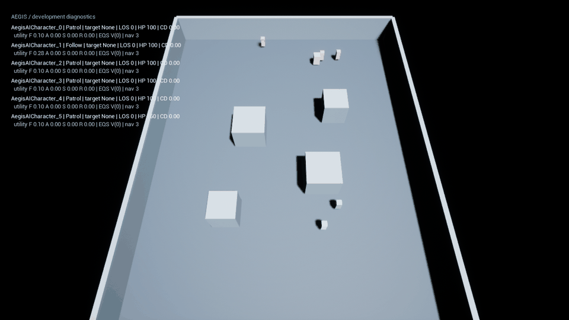
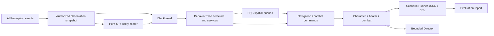

# Aegis Arena

**Unreal C++ Game AI Systems & Evaluation Lab**

A small AI architecture and evaluation project: one arena specification, a player, a companion, an enemy, and an elite variant. The goal is explainable decisions and reproducible evidence, not content volume.

**Current status: real UE 5.8.2 Editor/Game builds, ten saved native assets, five Core Automation tests, one game-world Functional Test, 60 native policy episodes and 12 rendered performance episodes have passed. Standalone Development and Shipping packages have been built and launched; Development batch output and the Shipping diagnostic boundary were checked.** [Current acceptance ledger](docs/status.md).



*Thirteen actual engine frames sampled every 0.5 game seconds, resized to 960×540. The 2 fps GIF sampling rate is not gameplay performance. Primitive geometry, movable lights and original AI diagnostics; no mock engine screenshots.*

[Download Windows builds](https://github.com/QiQiyzhu/aegis-arena/releases/tag/v1.0.0-native) · [Run and acceptance details](docs/release.md)

**Start the technical review here:** [When the companion survives but the team does not](docs/decision-case-study.md). Trace 30 paired native outcomes, a real counterexample, an episode-termination confound and an Automation false positive. [30-second / 3-minute / 8-minute walkthrough](docs/interview-deep-dive.md) · [Reproducible data for preference exploration](evidence/unreal/decision-case.json). The preference index only reweights existing observations; it does not run a new policy.

## Verified evidence

| Evidence | Result | Source |
|---|---|---|
| Strict C++17 build | Clang 20.1.2 through Zig 0.15.2; warnings treated as errors | [Build + assertions](evidence/portable/evaluation/report.json) |
| Core assertions | 325 passed | [Tests](core/tests/tests.cpp) |
| Python tool and evidence tests | 16 passed: 7 tool/integration, 2 native acceptance-gate and 7 endpoint reanalysis cases | [Tools](scripts/test_tools.py), [Reanalysis](scripts/test_decision_case.py) |
| Fixed evaluation set | 60 episodes: 30 priority + 30 utility | [Raw episodes](evidence/portable/evaluation/episodes.json) |
| CPU model sampling | 20 episodes, 1 / 10 / 25 / 50 enemies | [Results](evidence/portable/performance/report.json) |
| UE 5.8.2 Game Development build | MSVC 14.50.35738 + Windows SDK 26100: compiled and linked | [Actual build/cook log](evidence/unreal/environment/development-package.log) |
| UE 5.8.2 Game Shipping build | Compiled and linked; nine debug markers absent (static check) | [Actual binary gate](evidence/unreal/environment/shipping-string-gate.json) |
| UE Editor and saved asset inspection | Actual Editor compilation; ten native assets, real BT/BB/EQS wiring and navigation bounds | [Inspection](evidence/unreal/asset-inspection.json) |
| UE Core Automation / Functional Test | 5 / 1 passed; Functional executes 12 PIE world assertions | [Automation](evidence/unreal/automation/index.json), [Functional](evidence/unreal/functional/index.json) |
| Native policy comparison | 60 real UE episodes, paired seeds, fixed game timestep + NullRHI | [Native evaluation](docs/native-evaluation.md) |
| Rendered native sampling | 12 sustained 15s episodes, four loads, D3D12 / RTX 4060 Laptop | [Performance and limits](docs/performance.md) |

In the native four-enemy stress encounter, both policies won **0/30**. Utility had fewer companion deaths **at episode termination (6 vs 25)**, but higher cumulative player damage taken and lower allied damage output. Its episodes also ended earlier on average, changing the companion's observation window. This endpoint cannot establish improved protection or longer companion survival. The difficulty creates a win-rate floor; these results do not establish overall policy superiority. [Native results and uncertainty](docs/native-evaluation.md). The [earlier portable model results](docs/evaluation.md) remain separate.

## Run the verified layer

Requirements: Python 3.10+, a C++17 compiler (`clang++` / `g++` / Zig). No Python packages are required for tests or benchmarks. Pillow is needed only to regenerate the animation.

From a fresh clone, enter the repository directory and run this single command on Linux with `g++` installed:

```bash
python3 scripts/verify_portable.py --compiler g++
```

It builds both executables, runs the core assertions and sixteen Python test cases, then runs the two-episode smoke configuration. No prebuilt binary, ignored local toolchain, Pillow, engine installation or credentials are required. Logs and raw JSON/CSV go to a new timestamped directory under `outputs/`. Add `--full` to include all 60 evaluation episodes.

Windows with an existing compiler:

```powershell
python scripts/verify_portable.py --compiler 'D:/Tools/zig/zig.exe'
```

Replace that example with your actual absolute `zig.exe` or `clang++.exe` path. If a supported compiler is already on PATH, omit `--compiler`.

Individual commands remain available:

```bash
python3 scripts/build_portable.py --compiler g++
python3 -m unittest discover -s scripts -p 'test_*.py' -v
python3 scripts/run_benchmark.py --scenario scenarios/smoke.json --output outputs/my-smoke
python3 scripts/run_benchmark.py --scenario scenarios/evaluation.json --output outputs/my-evaluation
python3 scripts/run_benchmark.py --scenario scenarios/performance.json --output outputs/my-performance
```

CMake is also supported: `cmake -S . -B build-cmake`, `cmake --build build-cmake --config Release`, then `ctest --test-dir build-cmake -C Release --output-on-failure`. This CMake path builds/runs C++ tests; use the Python commands above for the scenario/report pipeline. The repository does not download tools automatically. Existing report directories cannot be overwritten accidentally.

The [portable GitHub Actions workflow](.github/workflows/portable.yml) uses Ubuntu `g++`, runs the same strict build, sixteen Python tests, smoke and full evaluation configurations, and uploads raw JSON/CSV plus build provenance. **It does not install or execute Unreal.** See the [hosted per-commit runs and evaluation artifacts](https://github.com/QiQiyzhu/aegis-arena/actions/workflows/portable.yml) for the current branch result.

## Unreal adapter

Target **UE 5.8.2**, compatible MSVC, Windows SDK and the additional .NET Framework SDK required by the Editor build. Follow [the exact installation/build/asset/acceptance procedure](docs/unreal-setup.md). The ten checked-in map/AI/material assets were generated and saved by the actual Unreal editor. Engine primitive assets remain references to the installed engine. `-GenerateAssets` is only for an intentionally asset-free checkout; it refuses to overwrite the included maps.

```powershell
./scripts/build_unreal.ps1 -EngineRoot 'D:/Program Files/UE_5.8' -CacheRoot 'D:/AegisWork' -Automation
```

C++ owns health, faction filtering, ranged/melee traces, cooldowns, observation boundaries, utility scores, director constraints, scenario capture, and debug controls. **Blueprint/assets own BT/EQS graph composition, asset references, presentation tuning, and map configuration.** StateTree and Learning Agents are not enabled: [why](docs/rl-experiment.md).



## Review and interview

- [Architecture / ownership](docs/architecture.md)
- [AI design / BT asset specification](docs/ai-design.md)
- [Native evaluation / raw data and limitations](docs/native-evaluation.md)
- [EQS failure investigation and actual runtime diagnostics](docs/eqs-debugging.md)
- [Separate portable evaluation / metric definitions](docs/evaluation.md)
- [Performance / limits of these measurements](docs/performance.md)
- [RL experiment status](docs/rl-experiment.md)
- [A–T interview dossier: architecture, 10 code exercises, 20 follow-ups, five honest bullets](docs/interview-dossier.md)
- [Original interview guide](docs/interview-guide.md)
- [Acceptance ledger and remaining scope](docs/status.md)
- [Verified packaged release](docs/release.md)
- [AI-assisted development log and verification responsibility](docs/ai-development-log.md)

Code is MIT licensed. Primitive geometry is authored here; Engine default mesh references resolve from the user's licensed Unreal installation. No downloaded art or marketplace packs are included. Source licensing does not relicense the Unreal runtime distributed with packaged builds. [Provenance](ASSETS.md).
