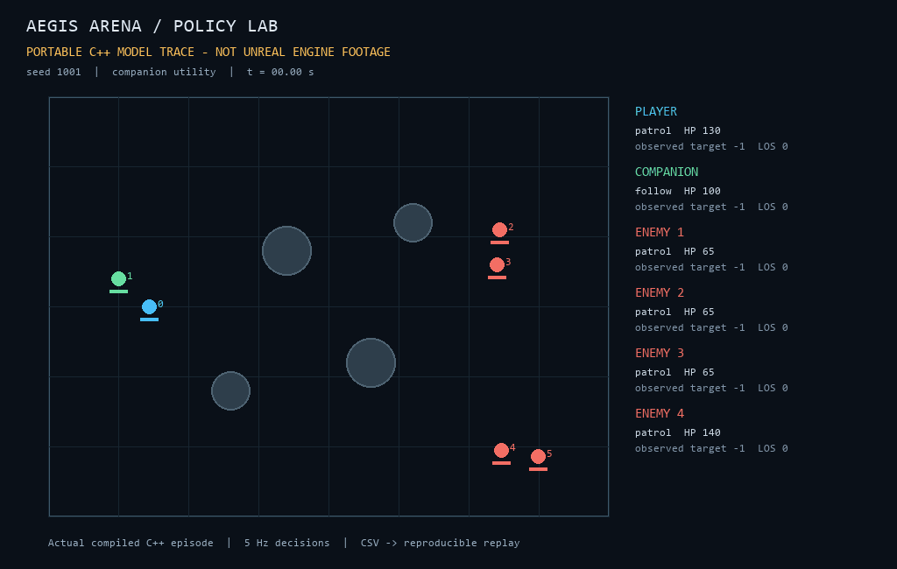
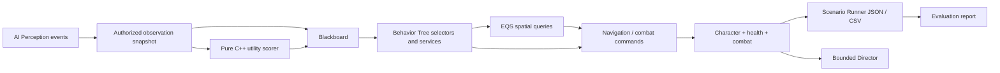

# Aegis Arena

**Unreal C++ Game AI Systems & Evaluation Lab**

A small AI architecture and evaluation project: one arena specification, a player, a companion, an enemy, and an elite variant. The goal is explainable decisions and reproducible evidence, not content volume.

**Current status: the portable C++ decision/model layer is compiled and evaluated. The UE 5.7 adapter is source complete for review but has NOT been compiled or run in Unreal on this machine.** No Unreal gameplay video, BT screenshot, EQS capture, engine performance claim, or RL result is presented as completed. [Exact acceptance gaps](docs/status.md).



*The animation replays [actual CSV positions and states](evidence/portable/trace.csv), seed 1001. It is a diagnostic model view, not an Unreal render.*

## Verified evidence

| Evidence | Result | Source |
|---|---|---|
| Strict C++17 build | Clang 20.1.2 through Zig 0.15.2; warnings treated as errors | [Build + assertions](evidence/portable/evaluation/report.json) |
| Core assertions | 325 passed | [Tests](core/tests/tests.cpp) |
| Python integration tests | 7 passed, including actual binary JSON/CSV round trip | [Tests](scripts/test_tools.py) |
| Fixed evaluation set | 60 episodes: 30 priority + 30 utility | [Raw episodes](evidence/portable/evaluation/episodes.json) |
| CPU model sampling | 20 episodes, 1 / 10 / 25 / 50 enemies | [Results](evidence/portable/performance/report.json) |
| UE compilation / Automation / functional map | Pending installed UE 5.7 and compatible MSVC | [Setup](docs/unreal-setup.md) |

The utility companion won **19/30** episodes versus the priority baseline's **20/30**. It died in **6/30** versus **16/30**. This is a survival/offense tradeoff in this model, **not proof that utility is a better policy**. [Evaluation and uncertainty](docs/evaluation.md).

## Run the verified layer

Requirements: Python 3.10+, a C++17 compiler (`clang++` / `g++` / Zig). No Python packages are required for tests or benchmarks. Pillow is needed only to regenerate the animation.

From a fresh clone, enter the repository directory and run this single command on Linux with `g++` installed:

```bash
python3 scripts/verify_portable.py --compiler g++
```

It builds both executables, runs the core assertions and seven Python test cases, then runs the two-episode smoke configuration. No prebuilt binary, ignored local toolchain, Pillow, engine installation or credentials are required. Logs and raw JSON/CSV go to a new timestamped directory under `outputs/`. Add `--full` to include all 60 evaluation episodes.

Windows with an existing compiler:

```powershell
python scripts/verify_portable.py --compiler 'D:/Tools/zig/zig.exe'
```

Replace that example with your actual absolute `zig.exe` or `clang++.exe` path. If a supported compiler is already on PATH, omit `--compiler`.

Individual commands remain available:

```bash
python3 scripts/build_portable.py --compiler g++
python3 -m unittest discover -s scripts -p 'test_*.py' -v
python3 scripts/run_benchmark.py --scenario scenarios/smoke.json --output outputs/my-smoke
python3 scripts/run_benchmark.py --scenario scenarios/evaluation.json --output outputs/my-evaluation
python3 scripts/run_benchmark.py --scenario scenarios/performance.json --output outputs/my-performance
```

CMake is also supported: `cmake -S . -B build-cmake`, `cmake --build build-cmake --config Release`, then `ctest --test-dir build-cmake -C Release --output-on-failure`. This CMake path builds/runs C++ tests; use the Python commands above for the scenario/report pipeline. The repository does not download tools automatically. Existing report directories cannot be overwritten accidentally.

The [portable GitHub Actions workflow](.github/workflows/portable.yml) uses Ubuntu `g++`, runs the same strict build, seven Python tests, smoke and full evaluation configurations, and uploads raw JSON/CSV plus build provenance. **It does not install or execute Unreal.** A workflow definition is not evidence of a hosted pass; consult the repository's actual Actions run after publication.

## Unreal adapter

Target **UE 5.7, latest available hotfix**, Visual Studio 2022 17.14, C++ game development workload and Windows SDK. Follow [the exact installation/build/asset/acceptance procedure](docs/unreal-setup.md). Engine content and `.umap` files are generated by Unreal, never fabricated by scripts outside the editor.

```powershell
./scripts/build_unreal.ps1 -EngineRoot 'D:/Epic/UE_5.7' -Automation
```

C++ owns health, faction filtering, ranged/melee traces, cooldowns, observation boundaries, utility scores, director constraints, scenario capture, and debug controls. **Blueprint/assets own BT/EQS graph composition, asset references, presentation tuning, and map configuration.** StateTree and Learning Agents are not enabled: [why](docs/rl-experiment.md).



## Review and interview

- [Architecture / ownership](docs/architecture.md)
- [AI design / BT asset specification](docs/ai-design.md)
- [Evaluation / metric definitions](docs/evaluation.md)
- [Performance / limits of these measurements](docs/performance.md)
- [RL experiment status](docs/rl-experiment.md)
- [Interview guide: 10 source files + five evidence-backed bullets](docs/interview-guide.md)
- [Remaining UE acceptance gates](docs/status.md)
- [AI-assisted development log and verification responsibility](docs/ai-development-log.md)

Code is MIT licensed. Primitive geometry is authored here; Engine default mesh references resolve from the user's licensed Unreal installation. No downloaded art, marketplace packs, or engine binaries are redistributed. [Provenance](ASSETS.md).
