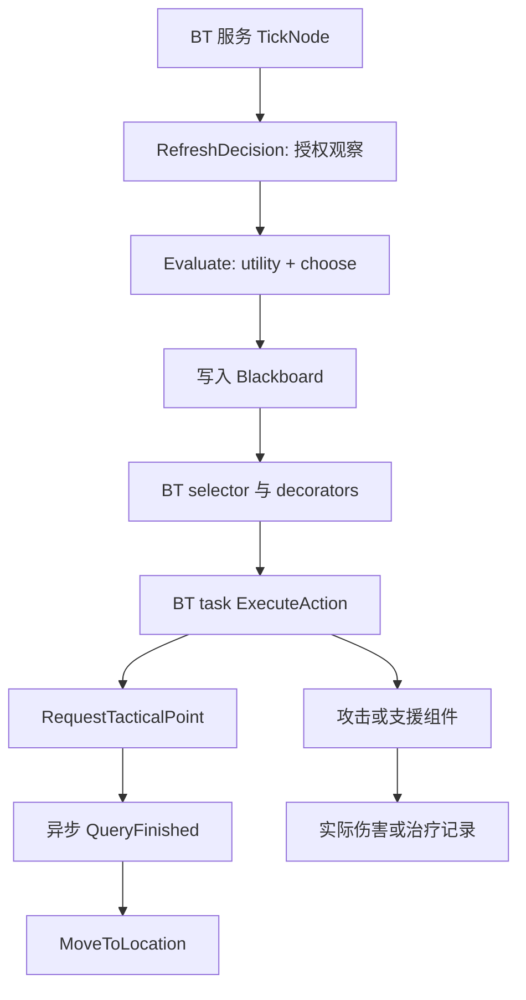

# 从 C++ 读懂 Decision Lab

Decision Lab 用同一套 Unreal 角色、感知、行为树和导航来展示四种同伴意图：Follow、Attack、Support、Retreat。Utility 计算“现在更想做什么”，BT 检查条件并尝试任务，EQS 为部分任务寻找位置，角色组件负责实际移动、射击和回血。界面和日志分别记录这些阶段，便于解释一次决定为什么没有产生预期效果。

这是一套手工规则与引擎 AI 系统组合的实现，没有强化学习训练、奖励函数或训练得到的策略。本文说明当前可读的调用链和唯一执行改动：ally position link（队内位置链接）。它的效果仍应以原生比较结果为准。

## 建议阅读顺序

| 顺序 | 文件与入口 | 先回答的问题 |
|---|---|---|
| 1 | [AegisDecisionLab.cpp](../Source/AegisArena/Private/AegisDecisionLab.cpp)：`Initialize`、`StartEncounter`、`SpawnBot` | 谁参与本局？同一配置怎样进入手动与自动模式？ |
| 2 | [AegisAIController.h](../Source/AegisArena/Public/AegisAIController.h)：`UAegisDecisionComponent`、`FAegisDecisionTelemetry` | 意图、真实任务和观测分别保存在哪里？ |
| 3 | [AegisAIController.cpp](../Source/AegisArena/Private/AegisAIController.cpp)：`OnPossess`、`RefreshDecision` | AI 可以知道哪些信息？它何时更新这些信息？ |
| 4 | [rules.hpp](../core/include/aegis/rules.hpp)：`Observation`、`utility`、`choose` | 四个分数怎么算？为什么没有选原始最高分？ |
| 5 | [AegisEditorLibrary.cpp](../Source/AegisArenaEditor/Private/AegisEditorLibrary.cpp)：`BuildAIAssets` 内的 BT 构造、`Branch`、`Query` | Blackboard 条件如何变成真实 BT 分支和 EQS 测试？ |
| 6 | [AegisAIController.cpp](../Source/AegisArena/Private/AegisAIController.cpp)：`ExecuteAction`、`RequestTacticalPoint`、`QueryFinished` | 任务成功返回到底表示什么？异步结果怎样落地？ |
| 7 | [AegisCharacter.cpp](../Source/AegisArena/Private/AegisCharacter.cpp)：`FireAt`、`Melee`、`ApplyDamage`、`Heal` | 谁真正命中、扣血、回血或死亡？ |
| 8 | [AegisDecisionLab.cpp](../Source/AegisArena/Private/AegisDecisionLab.cpp)：`RecordDamage`、`Sample`、`Finish`；[HUD](../Source/AegisArena/Private/AegisDecisionLabHUD.cpp) | 显示和报告能支持哪些结论？ |

纯决策规则文件实际叫 `rules.hpp`，项目没有 `decision.hpp`。`UAegisDecisionComponent` 的实现与 controller 放在同一个 `.cpp`，不要寻找不存在的独立组件实现文件。

## 1. 从实验入口到被控制角色

`AAegisScenarioRunner::Startup` 先等待场景导航通过预检，再检查 `-AegisDecisionLab`，创建独立 lab 后返回。Lab 借用已有 runner 的 BT/EQS 资产，但由自己的 `StartEncounter` 和 `SpawnBot` 创建实验参与者、记录本局结果。自动模式的 player 明确是一个 BT 控制的 AI；手动模式则创建 `AAegisPlayerCharacter` 交给真实 PlayerController。Companion 和敌人仍走同一条 AI 路径。

`SpawnBot` 在 `FinishSpawning` 前设置 Team、companion 标记、seed、行为树和三个 EQS 资产，固定 `bTacticalTrial=false`，本场景不生成精英。角色的 AIController 在 `OnPossess` 中接收配置，设置团队，绑定感知回调，初始化 Blackboard，再调用 `RunBehaviorTree`。

这里的 `Senses->RequestStimuliListenerUpdate()` 有实际作用：感知组件可能先于 possession 注册；那时 controller 还没有有效 pawn/team。显式刷新可以让已经存在的玩家进入正确的阵营感知关系，避免“后生成的敌人根本看不见先生成的玩家”。它是监听器初始化修复，不是给 AI 开放全场敌人列表。

## 2. 服务先收集观察，纯规则再打分

`UBTService_AegisObserve::TickNode` 调用 `RefreshDecision`，服务间隔配置为 0.2 秒，随机偏差为 0。树的根 sequence 还包含动作后的 0.2 秒 Wait。它们受 Unreal 调度，不应把每次实际间隔宣传成严格相等。

`RefreshDecision` 先检查暂停、死亡、停止状态和 Blackboard，然后从 `GetCurrentlyPerceivedActors(Sight)` 获取可见集合。它从中挑选可见敌人，并识别被看到的玩家队友。Decision Lab 的 **Observation 层**仍以 sight 决定 `allyKnown`，没有采用战术模式可同时提供队友血量的位置链接。Improved 的独立链接只在后面的 Follow 执行及其专用遥测中消费；所以 `allyKnown=false` 仍会压低 Follow 分数并禁止 Support 选择，却不再必然让 improved 的 Follow 执行失败。

随后它构造 `aegis::Observation`，只包含：自身血量比例、已知队友血量和距离、目标可见/记忆状态、可见目标距离、支援是否冷却完成。引擎中的距离是厘米，送入规则的距离除以 100，单位为米。没有当前 sight 时 targetDistance 填 1000；这表示策略没有当前敌人距离，不能解释成敌人真的在 1000 米外。

`Evaluate` 调用纯 C++ 的 `utility(O)`。四个分数按 Follow、Attack、Support、Retreat 顺序存放。函数拿不到 Actor、World 或敌人注册表，只能使用传入观察。例如未知队友的 Support 分数为 0；知道队友但冷却未好或队友血量不低于 80%，Support 也为 0。

`choose` 先求原始最高分，再与上一动作分数比较。如果优势不足 0.08，就保留上一动作，减少接近分数导致的来回切换。Telemetry 同时保留 `RawWinner`、`Previous`、`Selected` 和 `SelectionReason`，因此“不是最高分却继续执行”有可核对的解释。

priority 同伴分支更简单：有可见目标就选 Attack，否则选 Follow。它仍计算四个分数供观察，但这些分数不参与 priority 的选择。`bImprovedPolicy` 不改变这些公式或迟滞；它仅启用下面介绍的 Follow 位置来源回退。

## 3. Blackboard 决定意图能否变成任务

`RefreshDecision` 把 Selected 写成 `UtilityAction`，并写入 `HasLOS`、`HasMemory`、`InRange`、`NeedsRecovery` 等条件。`UtilityAction` 的数字映射为 Follow=0、Attack=1、Support=2、Retreat=3。

BT 的 companion selector 按顺序尝试：

| BT 任务 | 主要条件 |
|---|---|
| Recover | Selected 为 Retreat，而且血量低于 65%、没有目标记忆 |
| Retreat | Selected 为 Retreat，而且仍有目标记忆 |
| Support | Selected 为 Support |
| Attack | Selected 为 Attack，而且目标当前可见、距离小于 9 米 |
| Chase | Selected 为 Attack，而且有目标记忆 |
| Follow | 上述任务未成功时的回退 |
| Wait | Follow 也失败时短暂等待 |

`UBTDecorator_AegisCondition` 只比较 Blackboard 键；共享 BT 模板本身不保存某个角色的观察状态。非 companion 角色走另一组 priority 分支：Retreat、Recover、FindCover、Attack、AttackPosition、Investigate、Patrol。自动实验中的 scripted player 也属于这条非 companion 分支。

`UBTTask_AegisAction::ExecuteTask` 调用 `ExecuteAction(Action)`，把返回的 bool 转为 BT Success/Failure。失败会让 selector 继续尝试后面的分支。因此要分别读 `Selected`、`BTLeaf`、`BTLeafSucceeded` 和 `AcceptedBTLeaf`：一个是意图，一个是最近尝试，一个是尝试结果，最后一个是历史上最近被接受的任务。

这些任务不是持续等待完成的 latent task。尤其 Attack 在武器冷却期间仍可返回 true，Retreat 在查询等待或导航过程中也可返回 true。BT Success 表示接受或维持该动作，不等于已经打中敌人或到达目的地。

### 唯一执行改动：Follow 的显式队内位置链接

Lab 在参与者创建成功后调用 `SetFollowPositionLink(Player)`，显式登记这名同伴所跟随的友军。API 只接受自身为非 tactical companion、目标不是自己、双方同队且非 Neutral 的组合；敌人、非 companion controller 和 tactical 模式不能登记。它保存弱引用，不自行搜索角色。

Baseline 和 improved 都可以登记相同引用，但只有 improved 消费位置。`ExecuteAction(Follow)` 优先使用原有 `ObservedAlly`；失去这个视野来源时，improved 才回退到已登记位置链接，继续使用原来的 `MoveToActor`、250cm 启动距离和 200cm 接受距离。这里没有新扫描动作、伤害补偿或导航传送。

链接只开放友军位置。`RefreshFollowLinkTelemetry` 只读取该 actor 的位置，另存位置/距离/采样时间；它不读友军血量，不写 `Observation.allyKnown`，也不开放敌人信息。因此失去 sight 时，界面可以同时显示“视野内队友未知”和“队内位置链接可用”，Support 分数仍按未知队友计算。Support 执行分支也不会采用位置链接直接给看不见的队友回血。

权限失效、清空引用或关闭 improved 时，代码只取消 request ID 仍匹配的链接跟随请求，不取消后来启动的 EQS/chase 移动。Shutdown 与重新 possession 会清除链接。`FollowTargetSource` 记录最近实际 Follow 采用 `sight`、`team_position_link` 或 `none`，配套 `FollowTargetSampleGameSeconds` 表示这条记录何时产生。Baseline 的 `FollowLinkAvailable` 可为 true，但位置采样时间和距离保持 -1，表示已登记、没有消费。

这项比较改变了 Follow 执行时可用的友军位置信息，不能描述成“相同信息预算下换一组 Utility 权重”。移动产生的新视野还可能影响后续决策；这些后果应计入真实实验，而不是强行维持两条轨迹相同。

链接也可能在首次 Sight 服务观察之前就被 Follow 使用。最终开发案例的首条快照确实包含这种先执行、后观察的次序。因此同 seed 的两局可以从开局就分叉，不能把 baseline 后半局的停滞窗口直接移到 improved 的相同秒数，再声称只修复了那个局部片段。

## 4. EQS 提供位置，导航决定怎么过去

`FindCover`、`Retreat`、`AttackPosition` 先检查有效目标记忆，再把各自的查询资产交给 `RequestTacticalPoint`。每个 controller 同时最多一个在途查询，新查询还有 1 秒间隔。准备好的实例通过 `RunQuery` 异步执行，模式是 `SingleResult`。

EQS 的两种 context 分工明确：Querier 是 controller，`bAttachToPawn=true` 保证它的世界位置跟随 pawn；`UEnvQueryContext_AegisThreat` 则只提供仍被授权记住的 LastKnown 坐标。它不会在查询完成时偷偷读取隐藏敌人的新位置。

`AegisEditorLibrary.cpp` 的 `Query` 创建周围网格，投影到导航，再应用路径、遮挡和距离测试。Cover 要求遮挡，AttackPosition 要求清晰射线和距离范围；Retreat 的遮挡只是评分项，所以其成功结果不保证完全躲进掩体。

`QueryFinished` 首先核对 query ID，过期回调不能替换当前结果。随后检查停止/暂停、记忆、pawn 和返回项。合法结果写入 `SelectedPoint` 与 Blackboard，再调用 `MoveToLocation(SelectedPoint, 50)`。若 MoveTo 请求被拒绝，telemetry 记录 `move_rejected`；被接受则记录 `accepted`。

读取异步证据时，用 `QueryId + QueryDecisionSequence + QuerySubmittedBTLeaf` 找到发起原因，再看提交、完成和接收时间。完成时可能已经产生新决策，不能拿“此刻选中的动作”替代发起动作。`bQueryMoveAccepted` 只描述当时导航请求是否被接受；当前移动状态、实际位置变化和到达需要另外观察。

普通 SingleResult 不保留全体候选，`QueryGeneratedItems=-1` 表示没有保留，不能画成“0 个候选”。现有 opt-in EQS diagnostics 可保留有限查询的真实候选数据；它改变额外记录成本，不应为了展示把两组比较设置成不同模式。

## 5. Attack 和 Support 怎样产生真实效果

Attack 并不只信任较早的 Blackboard 条件。`ExecuteAction(Attack)` 在执行时重新检查目标 weak pointer 和 active Sight stimulus；失去 sight 则清除可见目标、返回失败。仍可见时它停止移动并朝向目标，180cm 内尝试 `Melee`，更远则调用 `FireAt`。

`FireAt` 检查存活、脉冲眩晕和武器冷却，确定起点、方向与最大射程，然后使用 `ECC_Visibility` 做真实 LineTrace。击中世界掩体就停；击中角色则调用 `Health->ApplyDamage`。友军不受伤害，也会挡住射线；可见某个敌人并不保证子弹一定命中它。`RangedShotsFired` 是实际接受的开火次数，不是命中次数。

近战使用向前的球形 Sweep，最终也走 `ApplyDamage`。该函数用纯规则的 `Health::damage` 检查敌我、存活和有效伤害上限，再更新 Current。只有实际扣血大于 0 才广播 `OnDamaged`；这时新血量已经写好，因此 runner 可以在同一伤害事件中识别 0HP 的死亡。之后才广播 `OnDeath`，角色执行停 AI、停止移动等死亡处理。

Support 使用 `RefreshDecision` 获取的 `ObservedAlly`。距离超过 250cm 时先 `MoveToActor`，接近后且冷却完成才请求 `Heal(22)`，再进入 5 秒支援冷却。`Heal` 返回实际增加量：满血时为 0，缺 8HP 时只返回 8。`RecordSupportHeal` 只累计正的实际返回量，所以 Support 意图、成功 BT 任务、治疗次数和回血量可以分别检查。

这条 classic Support 分支只检查已有 ally 引用、距离和冷却，没有额外执行一次支援几何射线。不要把 v1.3 tactical 分支的独立几何遮挡检查也描述为这里已经具备的功能。

## 6. 从一次决定读到一条可核对的记录

HUD 读取 controller 的 `GetDecisionTelemetry()`，不重新打分，也不遍历隐藏敌人来补全观察。调试视图把观察、四个分数、选择原因、BT 尝试和 EQS 接收点分开显示；回血反馈来自实际 Heal 返回值。

Runner 的 `RecordDamage` 按实际 Source/Victim 分别记录玩家、同伴输出与承伤。`Sample` 保存新的 decision snapshot，并在观察到 EQS 身份或状态变化时另写事件。`timeSeconds` 是本局相对时间，`worldGameSeconds` 是世界游戏时间；Observation 和 EQS 内部时间戳使用后者，可据此对齐。

Trace 中的 `selfPosition` 和 `navigationStatus` 是 runner 采样时的自身位置和导航状态；`observationGameSeconds`、`btExecutedAt`、链接的采样/执行时间可能略早。`executionSource=team_position_link` 还是“最近一次 Follow 的来源”，之后实际任务可能已经改为 Chase 或 Retreat。复核移动时必须同时核对最近尝试的任务、时间、连续位置差和导航状态；单看 source 或 accepted 都不够。与玩家距离缩短也同时受玩家运动影响，不等于已经到达导航目标。

动作驻留是采样估计：runner 使用上一采样点的有效任务状态累加，过期的 accepted leaf 或后续失败尝试归为 waiting，并按死亡事件时间截断存活区间。它不是引擎每帧完整的 BT 执行轨迹。**waiting 也不是全部静止时间**：同伴在队友附近接受 Follow、保持距离时，可以持续导航 Idle 而不计入 waiting。回血总量还可用“当前 HP − 上次 HP + 区间承伤”核对，这类 `health_accounting` 事件表示区间恢复量，不能当作精确施法时刻。

一次讲解可以按同一个时间段依次指认：**已知信息 → 分数和切换原因 → 实际任务 → 查询/移动或攻击/治疗 → 真实结果**。若 Support 已选中但尚未靠近，就应解释为“正在靠近，尚未回血”；若 EQS 接受了位置但仍在路上，就应解释为“移动请求已接受，尚未证明到达”。

## 与 v1.3 tactical / copilot 的边界

既有 objective trial 把 bots 设为 `bTacticalTrial=true`。同一个 `ExecuteAction` 会提前转入 `ExecuteTacticalTrial`，由 Guard/Focus/Rally、敌人角色、预警射击和换位逻辑执行战术行为；此时 Utility 分数不能解释实际动作。

v1.3 的 squad planner 属于另一条高层指令入口，向战术同伴下达受约束命令。Decision Lab 的比较不调用模型规划，也不把模型请求延迟或自然语言测试混入 BT/Utility/EQS 指标。需要讲解那部分时另读 [squad-copilot-explained.md](squad-copilot-explained.md)。

## 原生比较与复核入口

开发校准已经把改动聚焦为 Follow 丢失队友视野后失去执行目标；同一最终 Development 包的六局开发对照及事件复核已写入 [决策案例](decision-lab-case.md)。那里同时保留未获胜的局、实际移动片段、accepted 但零位移的反例，以及等待减少之外的负项。独立留出评估采用冻结后的配置与代码，其状态和结果以该报告及 [评估审计](decision-lab-evaluation-audit.md) 为准，不能用开发六局替代泛化证据。

初始候选及证伪约束见 [代码审计](decision-lab-code-audit.md)；其中 Retreat 是早期假说，不能替代本轮已选择的机制。历史不同源码版本的结果不并入本轮比较，NullRHI 自动实验也不代表真人体验或渲染性能。

## 冻结源码中的八个定位点

以下行号按本轮冻结源码核对；函数名是后续版本中更稳定的查找入口。

| 函数 | 源码位置 | 讲解重点 |
|---|---|---|
| `AAegisDecisionLab::StartEncounter` | [AegisDecisionLab.cpp:156](../Source/AegisArena/Private/AegisDecisionLab.cpp#L156) | 共用场景配置、不同 player 控制方式；创建成功后显式登记队友链接。 |
| `AAegisAIController::SetFollowPositionLink` | [AegisAIController.cpp:125](../Source/AegisArena/Private/AegisAIController.cpp#L125) | 同队 companion 权限校验和弱引用生命周期。 |
| `AAegisAIController::RefreshDecision` | [AegisAIController.cpp:320](../Source/AegisArena/Private/AegisAIController.cpp#L320) | Sight 观察、记忆、Utility 输入与 Blackboard。 |
| `UAegisDecisionComponent::Evaluate` | [AegisAIController.cpp:33](../Source/AegisArena/Private/AegisAIController.cpp#L33) | 纯规则分数与迟滞选择；没有学习训练。 |
| `UBTTask_AegisAction::ExecuteTask` | [AegisAIController.cpp:1056](../Source/AegisArena/Private/AegisAIController.cpp#L1056) | BT 尝试和接受结果分别记录。 |
| `AAegisAIController::ExecuteAction` | [AegisAIController.cpp:927](../Source/AegisArena/Private/AegisAIController.cpp#L927) | 攻击授权、真实任务及 Follow 的唯一回退改动。 |
| `AAegisAIController::QueryFinished` | [AegisAIController.cpp:453](../Source/AegisArena/Private/AegisAIController.cpp#L453) | 过期查询守卫、选中点与导航请求。 |
| `UAegisCombatComponent::FireAt` | [AegisCharacter.cpp:72](../Source/AegisArena/Private/AegisCharacter.cpp#L72) | 真实射线命中、掩体阻挡与实际伤害。 |
