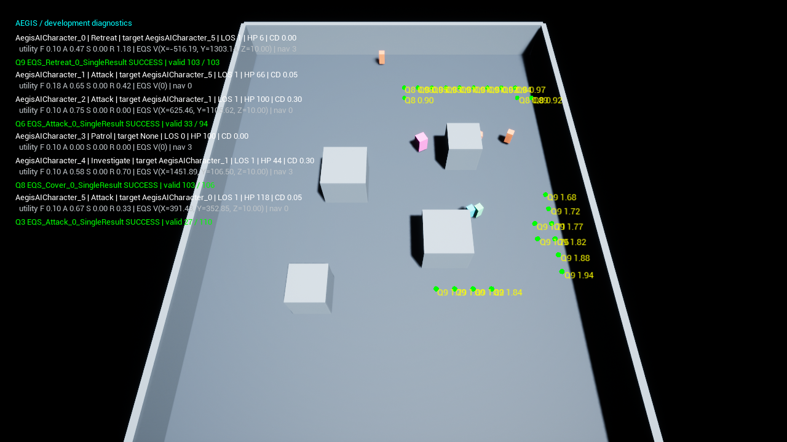

# EQS: a measured integration bug and its correction

The first native evaluation had **780 / 1300** failed queries with the priority companion and **991 / 1737** with utility. These numbers were a defect signal, not proof that the encounter simply lacked cover. The [pre-fix raw episodes](../evidence/unreal/before-eqs-fix/evaluation/report.json) are retained separately.

An independent source review found that `FEnvQueryRequest` owned by the AI Controller uses the Controller actor transform for UE's default Querier context. Unreal Controllers default to `bAttachToPawn=false`. After movement, our grid and path context therefore remained at the spawn point while the threat context used a current authorized observation.

We confirmed that hypothesis with **actual engine debug data**, enabled only by `-AegisQueryDiagnostics`. In seed 1001, query 1 at game second 5.083 had Controller location `(-1200, 0, 100)`, Pawn location `(-9.06, 419.09, 90.15)` and threat location `(1002.95, -98.16, 90.15)`. The attack grid's candidates all failed the actual engine Distance filter of 300–900 centimetres. Across that short run, five attack queries failed; the 489 discarded candidates in those failed queries all reported Distance as their failed test. [Raw candidate records](../evidence/unreal/before-eqs-fix/diagnostic/query-diagnostics.json).

The minimal correction sets `bAttachToPawn=true`, preserving the existing Controller-owned threat context and saved EQS assets. A second defect was the tactical BT task returning Success unconditionally, including a failed query's retry cooldown. It now succeeds only while a query starts/is pending or a valid tactical move remains active or its accepted point has been reached. Otherwise the existing selector can reach its lower-priority Attack, Investigate using authorized LastKnown, or Patrol branch. A rejected navigation request also clears the usable-point state. This does not fabricate a new tactical destination.

The same short seed after the fix produced **9 successful queries and no failed queries**, with Controller and Pawn coordinates matching. The main repeated 60-episode set produced **16 / 878 failures (1.82%)** for priority and **8 / 892 (0.90%)** for utility. Scheduling is not certified bit deterministic, so the short before/after runs are causal debugging evidence rather than a statistical policy comparison. [Post-fix diagnostic](../evidence/unreal/eqs-diagnostics/query-diagnostics.json), [final policy protocol](native-evaluation.md).

The native Functional Test now moves a possessed Pawn away from spawn and resolves the **real UE Querier context**, requiring the location to match. It also verifies missing Attack/Cover/Retreat query assets return failure, allowing selector fallback. Pending-query, valid-movement and reached-point paths remain alive until the next budgeted query replaces the point; the test does not claim exhaustive asynchronous cancellation coverage. [Twelve executed assertions and PIE marker](../evidence/unreal/functional/engine.log).

The optional overlay shows the last actually executed BT action names, Blackboard-derived target/LOS, utility values, EQS query IDs and candidate scores. It is a **runtime diagnostic visualization, not a screenshot of the Editor BT/EQS debugger**. Candidate retention is capped at 50 queries per Controller, draws at most 12 valid candidates per result and is disabled in Shipping. `run_unreal_scenario.py` rejects combining it with performance measurement. Engine SingleResult debugging may retain more than one candidate internally; `returnedItems` is not interpreted as the number of chosen destinations.

```powershell
python scripts/run_unreal_scenario.py --engine-root 'D:/Program Files/UE_5.8' --cache-root 'D:/AegisWork' --output 'D:/AegisWork/Reports/my-query-debug' --enemies 4 --episodes 1 --seed 1001 --duration 25 --fixed-step --query-diagnostics
```

Remaining limits: the compact episode schema counts rejected/canceled query completions together; the opt-in raw diagnostic distinguishes success, abortion, performed test names and per-candidate filter reasons. A query's success is not proof of reaching its destination. Longer target-loss, moving-threat, repeated-batch and cancellation fixtures are still useful follow-ups.



This frame shows the recent Retreat task, query Q9 and its actual candidate scores. The actor overlay reports the most recently executed task; the BT itself also executes its authored Wait node between decisions.
