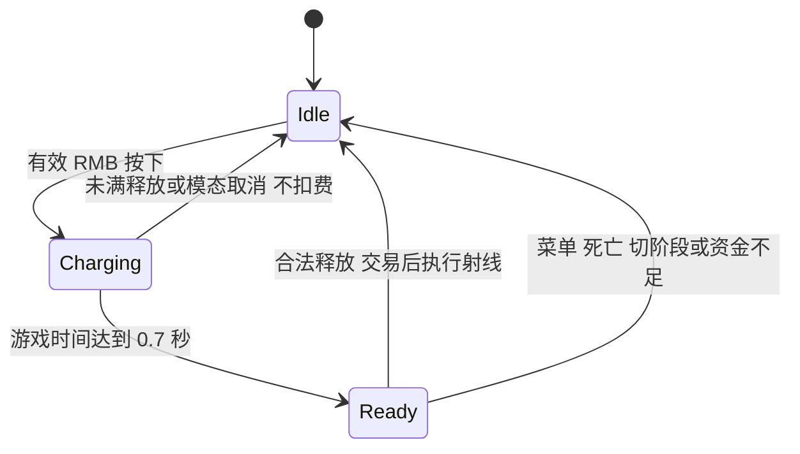

# Aegis Arena v2 C++ 讲解指南

状态：对应最终 r3 源码 `6dad19526dbc`。独立包控制 36 项、可选 Decision Lab 输入 35 项、完整录像及两轮配对观察均已保存原始记录；通过证据检查不代表玩法或策略全面改善。队友机制见 [AI 案例](portfolio-v2-ai-case.md)，自动玩家导航故障另见 [录制工具案例](portfolio-v2-recording-case.md)；两者不混为同一策略改进。正式验收已核对源码、内容、包体与交付证据。

## 先讲玩家选择再讲代码

面试开场可以说：这个原型让一份能量同时服务射击、解围、修复和目标推进。最需要保证的是输入被拒绝时不扣钱，扣钱后实际世界结果能核对，暂停和重开不会残留状态。C++ 被拆成输入、真实世界规则、纯账本和反馈四层，目的是让这些边界可检查。

| 文件或类 | 职责 | 不应越界做什么 |
|---|---|---|
| `AAegisPlayerCharacter` 与 `UAegisCombatComponent` | 瞄准、按住与释放、普通／蓄能射线及取消 | 不把按键按下直接记作伤害 |
| `AAegisScenarioRunner` | 阶段、占圈、争夺、升级和目标顺序 | 不把 UI 选择当作已完成目标 |
| `AAegisPortfolio` | 世界合法性、能量消费、实际收益与事件 | 不靠报告字段创造生命或目标结果 |
| `aegis::PortfolioEconomy` 与 `Operation` | 可移植收支／目标数学状态 | 不查询 UE 角色、射线或导航 |
| HUD 与 Presentation | 读取同一份状态并显示／播放反馈 | 不以动画结束代替技能执行成功 |
| `AAegisPortfolioCapture` | 自动玩家输入、原生截图和采样 | 不瞬移、不注入伤害，不充当队友控制器 |

对应实现：[角色与武器](../Source/AegisArena/Private/AegisCharacter.cpp)、[阶段与目标](../Source/AegisArena/Private/AegisLab.cpp)、[世界交易](../Source/AegisArena/Private/AegisPortfolio.cpp)、[纯账本](../core/include/aegis/portfolio.hpp)、[纯目标模型](../core/include/aegis/operation.hpp)。以下使用函数名定位，避免修改导致旧行号失效；历史 [v1.5 讲解](portfolio-cpp-guide.md)单独保留。

## 蓄能是一个可取消的输入状态

实际链条是输入映射 `Melee` 的 RMB 按下→`Strike`，松开→`ReleaseCharge`。v2 中 `Strike` 先通过 `CanAcceptCombatInput` 与 `Portfolio::CanCharge`，再记录游戏时间；`ReleaseCharge` 保存就绪条件、立即清除蓄能状态，合法时调用 `FireChargedAt`。旧模式仍执行近战。

`FireChargedAt` 在武器冷却、存活、受击硬直和方向合法之后调用 `TrySpendChargedShot`，接受后扣 12、设置 0.5 秒武器冷却并执行真实射线。默认最多两名敌人，穿透升级最多三名，墙与友军阻断。蓄能时普通开火暂停，打空也付费；不能把 `52×发数` 当作实际伤害。

恢复期保留普通移动与免费射击，但 `CanCharge` 要求 Active，禁止提前为下一波蓄能。角色 Tick 在交易上下文失效时取消，`SpawnTrialWave`、进入升级、结算和暂停入口也清除蓄能。计时使用游戏时钟，暂停不会用墙钟蓄满。测试仍需区分源码守卫与已执行的原生分支。

核查问题：Ready 不是“已扣费”；射击次数不是命中次数；扣费成功但打空属于合法成本。是否命中必须看实际伤害事件。蓄能满时 RMB 松开和 LMB 仍按住的顺序，是必须在世界输入探针中覆盖的路径。

## 修复报价和实际治疗必须相符

`GetRepairRecipients` 收集玩家与队友真实缺血；队友另需同队、存活、5 米内且掩体射线通畅。`GetRepairQuote` 给 HUD 预览，`TryRepair` 在执行时重新检查条件。自己受伤可独立治疗，队友无效不会一并禁止自疗。

规则是先把每人恢复量限制到其实际缺血，合计后乘 0.8 并向上取整，非零费用限制到 8 至 40。零合法治疗不付款、不启动冷却。E 最多自疗 30、队友 20，费用与实际恢复在同一游戏线程中提交；界面旧报价不能作为最终付款依据。

讲解 14 HP 的例子：v1.5 固定付 40；v2 规则报价为 `ceil(14×0.8)=12`，正式 `capture-packaged-02` 的首次 E 也确实记录自疗 14、队友 0、费用 12 与报价核对通过。对应输入、费用与实际恢复需要逐笔验证；不能只凭公式认定所有浮点边界都正确。

实现中每个受益者的缺血量来自 float，但定价使用两人的 double 求和再乘 0.8，避免 float 聚合过早越过 ceil 边界。`repair_applied` 保留两人实际治疗、float 聚合报价、费用、`quoteReconciled` 和冷却时刻；验收以实际治疗的 double 和计费，报价用 1e-4 容差核对，不能强制两个精度不同的总和在整数边界给出同一费用。

## 超频和共生使用不同的时间量

`TryOverclock`、`GetOverclockRemaining`、`GetOverclockMultiplier`、`IsOverclockUsed` 与 `CurrentRelayKey` 管理当前中继。每个中继只能消费一次，波次加中继索引的身份不能串点。F 仅在第一、二阶段当前有效数据中继圈支付 35，游戏时钟 6 秒内推进倍率 2；第三阶段撤离直接拒绝。争夺停止进度，但继续消耗该窗口。暂停冻结游戏时钟。

`UpdateInteractive` 每 0.1 秒观察一次，把距离上次观察的游戏时间截到 0.25 秒后传给 `UpdateObjective`。后者读取存活角色的 260 cm 圈内距离、敌人争夺和清敌状态，再调用 `Operation.observe`。F 乘时间、双人再乘 1.5，目标完成封顶且新点不继承余量。v2 为 8／10／4 秒，旧默认 4／4／3 保留。

V 经 `ToggleRelayRoute` 只在简报或第一阶段升级待选时改变第二阶段顺序。`SetObjectiveLocation` 使用路线与 relay 索引计算当前真实目标，并做导航投影。F 用 `wave*10+relay` 记唯一中继；切点后旧增益不会跟到新点。第三阶段要求先清敌且玩家在圈，队友不能单独撤离。

升级 3 通过 `ApplySymbiosis` 在这次观察确有目标进度时恢复圈内存活友军，每秒 2 HP。**治疗按有效游戏时间，不按进度单位**：`ProductiveTime=min(dt, 本次实际进度/(F倍率×双人倍率))`。目标末尾只使用剩余进度所需时间；没有进度就不调用，不能在已完成点刷血。每人恢复还受实际缺血限制。

解释系统取舍时可以用 10 秒单人占点：不用 F，最多提供 20 HP 的恢复窗口；F 使占点约 5 秒结束，恢复窗口最多 10 HP。两者都受争夺和缺血影响。加速与续航的张力来自规则交互，不需要宣称某个选项永远更优。

## 重开和账本是同一段生命周期

实际链条为 `StartInteractive` 清除按键并创建新玩家，`SynchronizePlayer` 结束旧账本再绑定新角色；两层共同清除成长、路线、蓄能、能量、超频和统计。`OnDamage` 记录真实承伤，以含对象 serial 的弱引用映射到本局递增身份，避免角色销毁后奖励重复；阶段奖励另按 1／2／3 去重。

`ObserveProgress` 位于 `Trial.observe` 之后、升级暂停之前，防止切入暂停后丢失阶段日志。`Trial` 的 180 秒使用游戏时间，包含选卡确认后的 5 秒恢复期，排除暂停时段；死亡和超时优先于同一次观察中的清敌。这是结束规则，不应把所有 `lost` 都写成玩家被击杀。

账本恒等式仍是 `60 + 实际入账 - 实际消费 = 当前能量`。消费必须逐笔相加：固定费 RMB/Q/F，加每次动态 E 费用。不能继续使用 v1.5 视频脚本中的 `Q次数×35 + E次数×40`。E 治疗与中继共生、救援 Q、阶段恢复分别统计；溢出不计入 earned，终局不能再消费。

## AI 与展示各自证明什么

当前 [AIController](../Source/AegisArena/Private/AegisAIController.cpp) 的 `OnPossess` 仍启动 BT，BT service 仍调用 `RefreshDecision` 更新感知、评分和黑板；不能写成 BT 或 Utility 计算完全停用。但 `ExecuteAction` 在 `bTacticalTrial` 时直接转入 `ExecuteTacticalTrial`，不执行后面的旧 Action 分支及 `RequestTacticalPoint`。Guard 的两个阵位采用真实 NavMesh 投影、完整路径和武器射线，不走历史 EQS 选点；被选中的旧 BT 叶名不能当作当前战术动作。

只有队友自身 Sight 中的 `ObservedTarget` 才授权候选点射线。旧 Guard 接受首个可达位置即返回，新 Guard 还检查从候选位置到目标的射线是否首先命中该目标，不合格才试另一侧；丢失 Sight 后不借记忆位置执行新筛选。它没有增加隐藏敌人的信息，也没有修改伤害或敌人规则。

这里实际遇到过一次“新筛选仍失败”：NavMesh 投影 Z=10 直接加胶囊半高 88 与武器偏移 30，生成 Z=128 的虚高枪口，越过顶部 Z=125 的低掩体；实际枪口只有 Z=120.150。`GetGuardCandidateMuzzle` 现在向物理地面做射线，验证地面可行走，用地面 Z＋半高＋当前行走地面间隙＋30 还原候选枪口，本次诊断值同为 **120.150**。它只修正新 Guard 的资格模型，不改变实际武器射线或敌人的信息权限。

最终 `6dad19526dbc` 构建的 baseline05／improved04 均通过 12 个原生断言与严格 gate：前者 0 枪、0 位移；后者 4 次资格检查、2 次拒绝、2 次另侧选择，交战阶段实际位移至少 120 cm，并有真实前摇和 1 次射击。380.26401268 cm 是整段夹具结束的净位移，含后续遮挡阶段，不能当作首发时位移。此夹具关闭伤害、使用静态领队和目标，观察窗口不同；新组还使用新缓存目录，不能声称全部系统环境相同。它只证明局部选点能转化为移动与开火。较早 df57 的 baseline04／improved02 留作开发历史；旧失败、fixture Editor DLL 绑定限制及最终核查见 [案例记录](portfolio-v2-ai-case.md)。

对照运行使用同一个 v2 二进制、场景与输入脚本；`-AegisGuardLegacy` 只关闭这次 Guard 阵位枪线筛选。局部原生夹具用于验证机制，独立种子的配对完整行动只报告这几个样本的收益与代价。`DebugState` 切换和一秒内 A→B→A 回返包含正常瞄准、开火与重新定位，不能直接叫作 Utility 决策抖动，也不能据三对样本宣称总体胜率提高。

最终三对新种子 5501／6607／7703 使用同一 r3 包和 1920×1080 执行配置，六局均 Won、队友存活、团队输出 1260；但 5501 新机制慢 10 秒且玩家多承伤 14，7703 只快 0.4 秒却玩家多承伤 104、队友多 42。对应同伴输出分别增加 38 和 24，6607 表内报告指标一致。状态切换减少不等于更好保护。旧 1280×720 的六局和卡角样本完整保留，后续仅统一执行配置并重新冻结未用种子；没有证明分辨率造成或解决卡角，不合并两轮计算胜率。

自然录像通过正常输入驱动，不能注入伤害、冻结 AI 或瞬移来制造胜利。受控原生探针可明确冻结 AI 或设置伤害，以验证取消／费用／争夺等边界，但其结果不能混进自然录像统计。纯 C++ 检查、UE 夹具、完整行动与真人测试分别标注；v1.4 的历史 36 局仍属于原规则版本。

## 录制驾驶器走输入链，不走队友策略链

开发录制入口由 [ScenarioRunner 创建并初始化 Capture](../Source/AegisArena/Private/AegisLab.cpp#L244)。[Initialize](../Source/AegisArena/Private/AegisPortfolioCapture.cpp#L31) 绑定 Runner、PlayerController、输出目录和截图回调；[Tick](../Source/AegisArena/Private/AegisPortfolioCapture.cpp#L78) 根据真实阶段发送简报确认、升级选择或 Active 驾驶，并分别保存世界采样和截图。升级面板暂停期间 Tick 仍能处理选择，但只有 Active 且未暂停才调用 [Drive](../Source/AegisArena/Private/AegisPortfolioCapture.cpp#L156)。

`Drive` 用玩家自身的 `LineOfSightTo` 与屏幕投影选可见目标，并读取公开的当前任务位置作为导航目标。每 0.4 秒从 `GetNavAgentLocation()` 脚底位置和目标分别做有限范围导航投影，再用 `FindPathToLocationSynchronously` 查询；只有 valid 且非 partial 的完整路径才保存。`pathQueryStatus` 分别记录导航不可用、起点投影失败、目标投影失败、无完整路径或完整路径，不能把 `pathPoints=0` 一概解释成世界碰撞卡死。

当前 r3 的 [清路恢复分支](../Source/AegisArena/Private/AegisPortfolioCapture.cpp#L230) 只在 v2、敌人数为零、没有可见攻击目标、路径点数组为空且离目标超过 120 cm 时检查。它将当前胶囊中心扫到目标 XY，终点 Z 保持当前中心高度，用缩放后的完整胶囊执行 `SweepTestByChannel`；参数直接取组件实际 `GetCollisionObjectType()` 和 `GetCollisionResponseToChannels()`，只忽略玩家自身。这样避免把运行时 `Custom` 误当成已注册的碰撞 profile。扫掠有阻挡时不输出这条恢复方向；无阻挡才允许尝试正常移动，不修改目标、碰撞、导航资产或角色位置。

最终方向按相机朝向转换为 W／A／S／D，经 [SetKey](../Source/AegisArena/Private/AegisPortfolioCapture.cpp#L55) 调用 `PC->InputKey(CreateSimulated(...))`，再进入玩家的 [Forward／Right](../Source/AegisArena/Private/AegisCharacter.cpp#L537) 与 `AddMovementInput`。鼠标瞄准、RMB、Q/E/F、冲刺和升级也通过正常输入发送。它是脚本化自动玩家，不是人工试玩；没有因为记录器需要胜利就跳过射线、扣费或阶段规则。

[Sample](../Source/AegisArena/Private/AegisPortfolioCapture.cpp#L326) 同时记录驾驶器方向、记住的 WASD、Controller 实际 WASD、位置、速度、输入禁用状态，以及 `clearRouteChecks`／`clearRouteAccepted`／`clearRouteRecovery`。前两项是检查帧与无阻挡通过帧，不是恢复到达次数；通过扫掠也不等于移动成功，必须继续核对实际位置。残余躲避窗口可以临时覆盖恢复方向，因此仅看 `clearRouteRecovery=true` 不足以证明归因。

`capture-packaged-calibration-03` 的 r3 独立包校准绑定源码 `6dad19526dbc`，严格 gate PASS，实际 Won **106.800006 游戏秒**，没有保存 PNG。清敌后实际触发 24 个恢复检查帧，对应 8 条恢复采样；首尾恢复采样相隔 0.7 秒，实际净位移 **269.511 cm**，随后恢复完整导航路径并正常撤离。这是一个种子、一个开放通道的工具恢复证据，不是全图导航保证，也不是 Guard 胜率或性能提升。此前超时局、未触发恢复的编辑器校准，以及 `Custom` profile 警告导致拒收的包体校准均保留在 [录制工具案例](portfolio-v2-recording-case.md)，不以新成功覆盖旧失败。

## 三分钟演示顺序

先用约 30 秒说明 v1.5 的固定修复费用与资源冗余。再用约一分钟展示蓄能排线、动态 E 报价和 F 推进，指出它们共用同一库存。接着用约一分钟解释 F 缩短共生治疗窗口、V 改变目标顺序。最后查看这次真实结算和一条拒绝／取消事件，说明尚未验证的人群与平衡问题。

如被追问实现，用一条完整事件链回答：输入守卫→世界合法性→账本提交→实际生命或进度变化→界面与日志。不要背诵所有类名，也不要把 AI 辅助完成的实现说成未经确认的个人独立经历。

## 可选讲解：已有 Squad Copilot

这是 **v1.3 的历史扩展**，用于讨论语言模型与即时游戏技能怎样分工；不是本轮 v2 的新成果。本轮玩法不依赖云端，正式录像、Guard 夹具及配对评测均未用 Copilot 生成行动。历史独立入口、API Key 配置与调用范围见 [v1.3 启动说明](upgrade-v4.md#启动与操作)；配置密钥并不等于已经验证模型的实战效果。

代码链是 [Tab 面板提交](../Source/AegisArena/Private/AegisPlannerUI.cpp#L126) → [BuildObservation／BuildSchema／RequestPlan](../Source/AegisArena/Private/AegisSquadPlanner.cpp#L178) → 异步 HTTP → [DecodePlan 与响应代次检查](../Source/AegisArena/Private/AegisSquadPlanner.cpp#L366) → [BeginStep／UpdateStep](../Source/AegisArena/Private/AegisSquadPlanner.cpp#L514) → 实际完成、失败或取消记录。自然语言只转换成 1–3 个 `guard`、`regroup`、`capture_relay`、`focus_visible` 有限任务；不能输出任意坐标或创造敌人。集火目标必须来自观测令牌，并继续满足队友自身 Sight；集合／占点的候选目标由 C++ 校验完整路径。请求限时与技能限时分开，云端请求最多 20 秒现实时间，每步最多 10 秒、全计划最多 35 秒游戏时间；Z/X/C 接管、重开及上下文失效会取消旧计划，晚到回复不能重新夺回控制。异常回到规则 Guard。

执行反馈也有限定含义：接近玩家、观察到中继完成、维持保护五秒、队友对指定可见目标造成真实伤害，各有不同判断；中继增长不证明队友独立贡献，保护计时不保证玩家安全。`Saved/AegisPlans` 保存采用与结果，短标签不是隐藏思维链；没有把它宣称为 RL、RAG 或自我学习。**历史云端游戏探针只证明 `capture_relay > guard` 计划接入和实际移动，约两秒后手动取消，未证明完整占点及后续 Guard 自动完成。** 讲解稿与证据边界见 [Squad Copilot 说明](squad-copilot-explained.md)，PUBG Ally／SIMA 2 的一手资料及本作借鉴范围见 [2025–2026 技术参考](upgrade-v4-references.md)。
