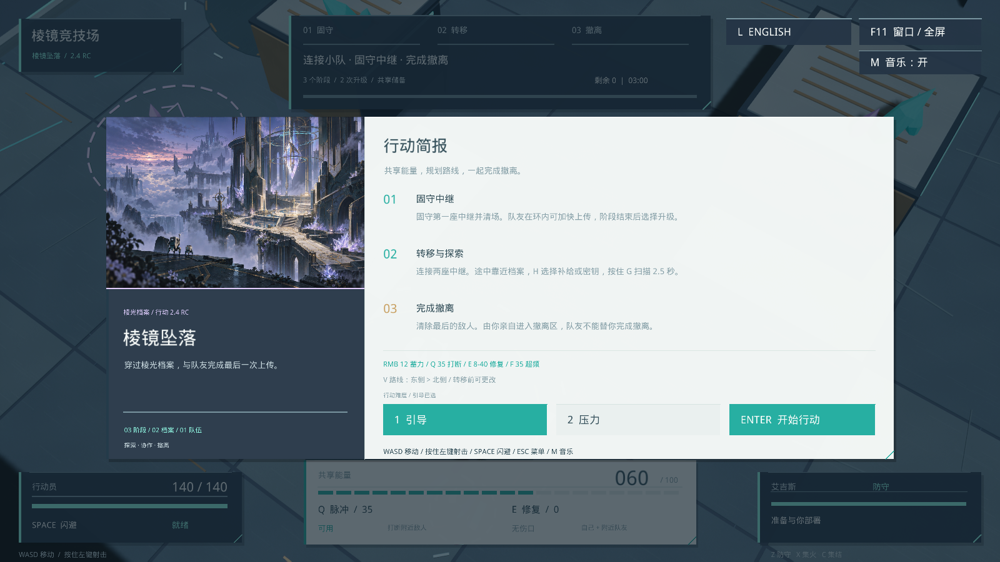

# v2.4.0-rc.1 · Windows 试玩候选版

2026-10-07。本次将本机的新版玩法、中文/英文界面、档案扫描和音画内容整理为可直接下载的 Shipping 包，补齐玩家启动、暂停、设置与退出流程。

**[下载 Windows ZIP](https://github.com/QiQiyzhu/aegis-arena/releases/tag/v2.4.0-rc.1)** · [三分钟上手](PLAY.md)

## 这次升级

- 解压后直接启动最新版，不需要编辑器、Python、隐藏参数或 AI Key。
- 语言、音乐和窗口模式可以保存，F11 切换窗口/无边框。
- 切出窗口自动暂停，回来后按 Esc 才继续；重开前会确认，取消保留当前局。
- 清楚的下载与按键说明，运行库与第三方许可随包提供。

## 本次验证

| 检查 | 结果 |
|---|---|
| 本地严格 C++ 核心 / 资源账本 | 381 / 32 项通过 |
| Python 工具与媒体协议 | 隔离 Python 3.11，391 项通过 |
| UE Core | 8/8 |
| 原生发布流程 / 扫描回归 | 10/10、25/25 |
| Shipping 编译与打包 | 成功，独立 EXE 可启动 |
| Shipping 开发功能隔离 | 19 项开发标记均不存在 |
| 真实 Shipping 窗口检查 | 启动、中英文、进入战斗、重开取消、Alt-Tab 暂停、手动恢复、音乐、F11、退出与重启偏好保存通过 |

操作检查由自动化发送真实键盘事件并观察游戏窗口，不是独立真人试玩。原生 fixture 的模拟焦点检查与实际 Shipping Alt-Tab 检查分别记录。详见 [窗口验收](../evidence/release-v2.4/shipping-ui-smoke.json)、[原生流程](../evidence/release-v2.4/native-release-flow.json)、[扫描回归](../evidence/release-v2.4/native-survey-regression.json)、[二进制检查](../evidence/release-v2.4/shipping-isolation.json)。

下载文件的 SHA-256 与完整文件清单见 Release 附件，以及 [包清单](../evidence/release-v2.4/release-manifest.json)。开发符号 PDB 不放入玩家 ZIP，原始构建包仍保留。GitHub 的可移植 CI 不运行 Unreal。

## 已知范围

仍是单张竞技场、三阶段单人游戏；不含联机、中途续关或实体手柄支持。没有完成最低配置测定、全新 Windows 安装验证、多显卡长时间稳定性和真人难度平衡测试。因此发布为候选版，不宣称商业商店发行认证。

[完整原生交付说明与复验命令](portfolio-v2.4-delivery.md) · [历史版本](readme-history-before-v24.md)
