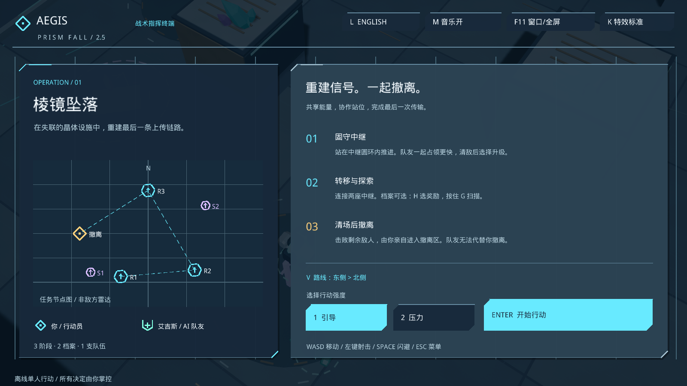

# v2.5.0-rc.1 · 战术终端与技能反馈

2026-10-07。**[下载 Windows 游戏](https://github.com/QiQiyzhu/aegis-arena/releases/tag/v2.5.0-rc.1)** · **[查看双游戏美术策划档案](https://arc-shift.black-kid-3047.chatgpt.site/art-direction/index.html)** · [三分钟上手](PLAY.md)

本版深化科幻小队的既有世界，用统一战术终端组织任务、能量、技能和队友信息，保留三阶段任务、升级、档案探索与实际战斗规则。

## 玩家可见变化

- 简报采用实际任务节点图；深蓝卡片、斜切角和细线贯穿暂停、升级与结算。
- 作战 HUD 突出当前行动、共享能量、四技能费用与可用状态；中文和英文均适配 1600×900 与 1280×720。
- 青色行动员、薄荷绿队友与修复、暖色敌方危险、紫色档案使用不同形状和节奏。
- 新增蓄力收束、释放闪片、方向闪避残影、修复脉冲、超频与任务完成反馈。
- **K** 或菜单按钮切换精简特效，减少装饰并保留弹道、蓄力、扫描与危险提示；偏好自动保存。
- 包内提供中文游玩说明、便携启动器、所需运行库和第三方许可。

## 验证与范围

| 项目 | 结果 |
|---|---|
| 原生界面和视觉夹具 | 1600×900 与 1280×720 各 21 项通过 |
| 原生技能回归 | 36/36；重开输入遵循二次确认 |
| 原生档案回归 | 25/25 |
| 原生核心自动化 | 8 项通过 |
| 完整任务脚本 | 真实战斗流程完成三阶段，110 帧证据及 174 条账本事件核对通过 |
| Shipping 构建及窗口实测 | 构建通过；9 项真实窗口检查通过，22 个开发标记已剔除 |

完整流程通过模拟按键驱动，包含档案、技能、升级和撤离，没有伤害、传送或冻结 AI 的流程夹具。艺术对比夹具会冻结 AI，并使用独立的展示 cue；两者证据分别记录。GitHub Portable CI 仅验证可移植 C++ 核心与 Python 工具，不在云端运行 Unreal。

[设计规则、预算和素材说明](art-direction-v2.5.md) · [原生验证原件](../evidence/art-v2.5/native-validation.json) · [完整按键表](portfolio-v2.5-play.md)

这是单竞技场、三阶段、Windows 64 位单人试玩候选版；没有多人联机和中途续关。已在一台 Windows 电脑验证，未完成最低硬件要求测定、多人设备兼容性或商店上架审核。项目方向由用户提出，Codex 协助实现与测试；不将自动化操作描述为人类试玩。

[发布包窗口复核](../evidence/art-v2.5/shipping-ui-smoke.json) · [发布包静态检查](../evidence/art-v2.5/shipping-static.json) · [逐文件 SHA-256 清单](../evidence/art-v2.5/release-manifest.json)
