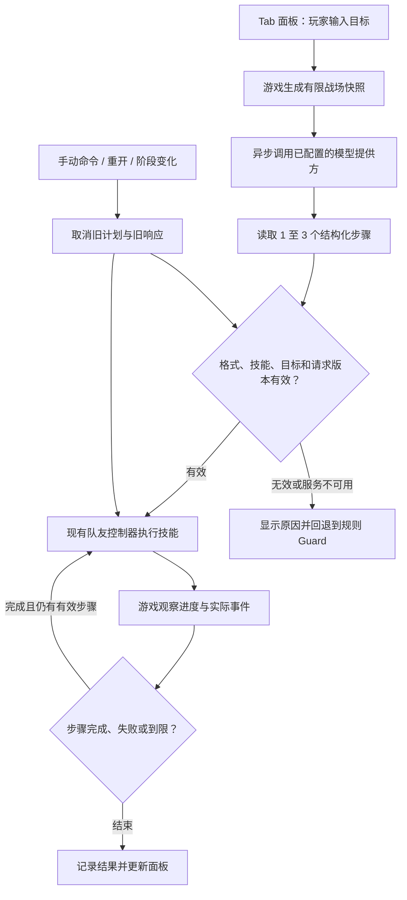

# Aegis Squad Copilot：怎样把一句话变成队友行动

更新日期：**2026-09-11**。本文按当前集成源码与实验记录编写。**模型语义评测、游戏内移动和取消、完整技能完成、独立包运行，是不同的证据。** 云端十二条合成观测案例、真实 UE 云端接入的十三项检查及受控 HTTP 异常的二十五项检查已通过；游戏探针没有证明完整占点及后续保护自动完成。包状态集中列于 [v1.3 升级记录](upgrade-v4.md#启动与操作)。

当前选择是**云端模型优先，规则 AI 保底，本地模型保留为实验选项**。用户已选择配置自己的 API Key。默认目标是 DeepSeek 的 `deepseek-flash`；本地 Qwen/llama.cpp 尚不作为可用的默认方案。相关研究与日期见 [近两年游戏 AI 技术参考](upgrade-v4-references.md)，其中本地方案属于研究阶段提案。

最终 Development 独立包已另行通过 30 项输入/退出与 13 项真实云端检查，原生截图和模型响应存于 [最终验收](../evidence/upgrade-v4/acceptance.json)。本轮总计十二条语义评测调用，加 Editor 和独立包各一次实际云端请求；受控 HTTP 故障不计入模型调用。两包构建完成、Shipping 静态 17 标记检查通过；合成输入的范围仍不等于人工试玩。

## 它解决什么问题

玩家可以告诉队友“先占住中继，然后掩护我”。语言模型把话语转为有限的任务顺序；游戏判断任务是否可执行，再通过已有技能移动、找射界和攻击。玩家表达的是目标，不必每一步都重新按集合或保护键。

效果要由行动证明：队友是否接近目标、目标是否完成、玩家改命令后旧计划是否停止。流畅的文字或合法的 JSON 都不是行为正确的证明。

## 当前状态和服务选择

| 部分 | 当前源码或实测记录 | 仍待验证 |
|---|---|---|
| Tab 面板 | `AegisPlannerUI.cpp` 使用 Slate 文本框、Enter 提交及三个示例按钮；Tab/Esc 或返回按钮关闭。真实云端和替代 HTTP 服务下分别通过十三项 Slate 流程检查，包含暂停、提交、关闭、取消与重开。 | 人工中文输入、按钮操作体验与不同分辨率。 |
| 执行器 | `AAegisScenarioRunner` 持有 `AAegisSquadPlanner`，包含四种技能、严格解析、异步 HTTP、取消与有时限的结果判断。云端计划驱动队友实际移动，约两秒后由探针手动取消。 | 完整占点后自动执行保护、多局支援效果、未覆盖的任务失败路径。 |
| 云端方案 | 用户已保存 DeepSeek 配置，目标为 `https://api.deepseek.com/chat/completions`、`deepseek-flash`。十二次一次性合成观测请求三层检查均为 12/12；另外的 UE 云端探针通过十三项。 | 新指令和复杂局势的可靠性；十二例语义实验本身没有运行 Unreal。 |
| 本地实验 | Qwen3-0.6B Q8_0 经本机 llama.cpp 的 `127.0.0.1:18765` 做过小样本实验，具体负结果见下文。 | 未见过的指令、并发游戏负载与其他模型规模；当前不作为默认方案。 |
| 手动控制 | 战斗中 Z/X/C 先取消模型计划，再发送手动指令；R 重开先取消计划、关闭面板，再创建新一局。Slate 流程覆盖执行中取消；受控延迟 HTTP 场景还覆盖等待时接管、重开与晚到计划不被采用。 | 其他未覆盖的异步时序与人工操作体验。 |

DeepSeek [当前官方模型页](https://api-docs.deepseek.com/quick_start/pricing/)在本次核实日将 `deepseek-flash` 对应到 **DeepSeek-V4.1-Flash**。这是云端模型标识，不能称为 0.6B 本地小模型，也不能套用 PUBG Ally 的硬件和延迟结论。

[Thinking Mode 文档](https://api-docs.deepseek.com/guides/thinking_mode/)说明默认启用 thinking；当前 Chat 请求显式使用顶层 `"thinking":{"type":"disabled"}`。低 temperature 或 `/no_think` 提示不能替代该参数。[JSON Output 指南](https://api-docs.deepseek.com/guides/json_mode/)及 [Chat Completions 接口](https://api-docs.deepseek.com/api/create-chat-completion/)规定 `response_format:{"type":"json_object"}`，提示里也要说明 JSON 格式。本轮不把 llama.cpp 的 `json_schema` 配置直接用于 DeepSeek Chat；游戏继续做严格解析，并拒绝空内容或截断回复。

## 云端实验已经证明的范围

在 [cloud-evaluation-01/report.json](D:/AegisWork/AI/v1.3/cloud-evaluation-01/report.json) 中，DeepSeek 完成十二次真实 HTTP 请求，每例只调用一次，没有重试或输出修补。调用前已将 [全部案例、可接受顺序和请求体](D:/AegisWork/AI/v1.3/cloud-evaluation-01/declared-cases.json) 写入文件：六条原有中英文命令，加六条新措辞，其中包括“不追击敌人”和“没有可见敌人时保护我”的限制。请求使用运行时提示与格式定义，观测为按运行时字段构造的合成状态。

原有六例与新增六例均通过 JSON 结构、技能及目标合法性、完整预定技能顺序检查，三层合计都是 **12/12**。请求总耗时为 **0.775–1.538 秒，中位数 1.021 秒**；这包括该次调用的网络等待，不能当作逐帧决策速度或跨网络延迟保证。独立只读复核还确认十二份已保存回复的外层 JSON 与计划内容都没有重复键或非有限数字。

这些结果说明模型在这十二条声明过的语义案例中给出了所需计划，**没有证明 UE 中技能完成、配合效果提高或任意新指令可靠**。新增六例主要是措辞与条件分支变化，样本量很小。独立严格 JSON 复核记录见 [classification-review.json](D:/AegisWork/AI/v1.3/cloud-evaluation-01/classification-review.json)。

另外，**[UE 云端 Editor 探针](D:/AegisWork/Reports/upgrade-v4-copilot-cloud-editor-01/provenance.json) 已通过十三项检查**：通过真实 Slate 提交，使用真实云端响应，验证 `capture_relay > guard` 顺序，返回战斗后观察队友移动超过 80 cm，再测试手动取消与重开。它使用 Editor `-game` 离屏渲染和合成输入；**约两秒后就按 Z 取消计划，没有等到完整占点和后续 Guard 自动完成**。此前 [Slate fixture-02](D:/AegisWork/Reports/upgrade-v4-copilot-fixture-02/provenance.json) 的十三项使用固定 HTTP 测试回答，只证明有限接入流程，不算模型推理。

**[故障探针](D:/AegisWork/Reports/upgrade-v4-copilot-fault-01/provenance.json) 的五类 HTTP 场景、二十五项检查通过**，覆盖坏 JSON、等待时手动接管、等待时重开、503 和实际等待约十秒的本地超时。它使用 NullRHI、直接 Planner API、合成按键及受控 HTTP 替身，没有真实模型调用，也没有测试 Slate 输入体验。延迟响应不被采用的结论限于这些已执行场景。

基础验证为 **381 条可移植 C++ 断言、117 项 Python 测试、6 项 UE Core（含 20 条模型协议断言）**，以及 Tactical 32、Weapons 31、Operation 31、Memory 28、Trial 54 项世界回归全部通过。[原始报告与快照边界](upgrade-v4.md#验证记录)逐项列出。云端游戏与战斗回归后，最终仅修正了 `AegisPlannerUI.cpp` 的 Submit 失败提示；其余文件摘要不变。故障探针在该修正之后执行，不能把所有结果说成同一源码快照。

## 本地实验为什么没有成为默认方案

这些是**本机离线指令样本实验**，没有同时运行 Unreal，也不是玩家试玩。首批六例在 [baseline-analysis.json](D:/AegisWork/AI/v1.3/baseline-analysis.json) 中记录：结构有效 **6/6**，目标约束有效 **1/6**，同时满足目标约束与所需主要技能的 `actionableIntent` 为 **0/6**。因此“HTTP 成功、能写 JSON”不能等同于“计划可用”。

修订提示后，同样六例的 [summary.json](D:/AegisWork/AI/v1.3/inference-revision01/summary.json) 与 [完整顺序复核](D:/AegisWork/AI/v1.3/revision-analysis.json)显示结构、目标约束和主要技能改善，但**完整意图顺序仅 4/6**：英文占点指令漏后续保护，英文攻击指令漏后续集合。该结果包含根据原样本修改提示的影响，没有独立保留集，不能报成泛化准确率或把主要技能 6/6 当作完整意图 6/6。详情见 [本地可行性记录](D:/AegisWork/AI/v1.3/FEASIBILITY.md)。

云端十二例已经按这些层次检查，但换模型及小样本全对仍不证明队友在实战中更聪明。

## 从输入到行动



**语言层决定做什么。** 解析器只接受 `label` 和 `steps`；步骤为 1–3 个，每步仅有 `skill`、`target`。标签限定为最多 80 个可打印 ASCII 字符，所以玩家可以输入中文指令，当前计划短标签仍为英文。模型不能发明技能、坐标或伤害数值。

下面是**格式示意，不是某次真实模型返回**：

```json
{
  "label": "Secure relay, then cover the player",
  "steps": [
    {"skill": "capture_relay", "target": "none"},
    {"skill": "guard", "target": "none"}
  ]
}
```

**实时层决定怎样做。** 既有控制器处理导航、位置、射界、冷却和攻击。语言模型不逐帧瞄准，也不直接修改角色血量。计划通过检查，只表示游戏允许尝试这些技能。

| 技能 | 当前代码的执行与完成语义 | 不能声称什么 |
|---|---|---|
| `guard` | 发出保护指令，维持五个游戏秒后完成步骤。 | 不能据此保证玩家安全、挡住伤害或发生命中。 |
| `regroup` | 向玩家附近可导航的位置集合；距玩家不超过 350 cm 时完成。玩家移动后会更新目标位置并再检查路径。 | 不能把发出移动命令当作已经到达。 |
| `capture_relay` | 前往当前公开目标；观察到本中继序号增长才完成。接近目标本身不算完成。完成后仍检查活动阶段是否有效。 | 序号增长可能包含玩家贡献，不能声称队友独立充能；第一波目标完成后若同时满足过关条件，后续保护可能因阶段结束而取消。最终撤离仍要求玩家到场。 |
| `focus_visible` | 使用快照中的可见目标 token，执行中继续检查队友 Sight；观察到队友对指定目标的真实伤害事件才完成。 | 开枪、隔墙记忆或其他角色的伤害不等于这一步的有效命中。 |

每步最多十个游戏秒，整个计划最多三十五个游戏秒；导航无进展还有较短的退出条件。暂停不消耗技能时间。请求使用独立的现实时间限制：源码为本地十秒、云端二十秒。故障探针已经观察到暂停期间约十秒的本地超时和显式回退；该结果不等于实际测过云端二十秒超时，也没有覆盖全部技能截止条件。

**观察有明确来源。** 快照包括玩家与队友的生命比例、队伍距离、公开目标状态，以及最多六个队友 Sight 当前感知的敌人。敌人以 `t0` 等本次请求 token 表示，模型不能浏览完整角色注册表。回复中的 token 要再次检查；旧 token 不能授权持续穿墙追踪。

**暂停与异步解决不同问题。** 暂停让玩家安全输入和阅读；异步 HTTP 避免把网络等待放在游戏线程。执行器暂停时仍能处理请求时限，技能恢复后才运行。回复必须匹配当前请求代次、玩家/队友/控制器、波次、中继及活动阶段。新命令、死亡、阶段变化或重开可以取消旧工作。正在执行的占点步骤允许把本次中继增长识别为完成，其余过期变化仍要拒绝。

**计划不会强行跨越失效阶段。** 如果占点时同时清光敌人并进入升级选择，旧活动阶段已经结束，剩余掩护步骤可能取消。现场要说明实际状态，不能把换阶段伪装成第二步成功。

**回退保留基本玩法。** 服务未配置、网络失败、回复不合法或任务无法执行时，代码回到规则 Guard 并记录原因；坏 JSON、503 和本地超时已在上述受控测试中观察到回退。`Saved/AegisPlans` 的记录关联请求、回复、采用、步骤与结果。配置工具把密钥加密保存在当前 Windows 用户下，启动器只通过子进程环境传入；配置工具的单元测试使用假密钥。云端实验使用用户授权的真实服务，凭据不写入请求记录或报告，也不展示隐藏推理文本。

## 与近两年技术的关系

PUBG Ally 的 2025–2026 官方资料介绍了高层语言认知与即时动作分工。SIMA 2 联系目标、行动与观察，但采用视觉/键鼠接口并经过专门训练。Aegis 借鉴分工方法，使用本作状态与现有技能，范围更小；换成云端提供方不会改变技能边界。

这里没有强化学习、RAG 或自我学习声明。调用现成模型不是训练，状态快照不等于检索增强，保存日志不会自动更新权重。面板短标签是任务摘要，不是隐藏思维链，也不被当作内部推理真实性的证明。

## 三分钟讲解稿

时间包含操作等待。现场只描述实际出现的结果，未返回或失败时照实解释。

**0:00–0:35，问题。** “原型已经有保护、集火和集合三个直接指令。这次加入语言目标，比如先占中继，再掩护我。模型把话语变成有限任务，游戏负责真正执行，原来的手动控制继续保留。”

**0:35–1:15，输入。** 部署后 Tab，输入 `Secure the relay, then cover me.`。“世界暂停，方便我输入。当前云端提供方收到指令和有限战场快照。这里等待实际回复，不是预设成功台词。回复还要检查技能、目标和请求是否过期。”只读出实际步骤。

**1:15–2:00，行动。** Tab 返回。“队友通过原来的导航和战斗技能行动。已经通过的云端探针观察到移动后就手动取消，没有证明完整两步完成。现场继续观察中继及后续任务；被争夺、失败或换阶段时说明实际原因。”按实际画面说明完成、执行中或失败，中继完成也不直接证明全部贡献来自队友。

**2:00–2:30，接管。** 返回战斗后按 Z。“现在我改为保护命令。它取代旧计划，旧响应晚到也不能夺回控制。R 重开同样取消旧请求，让新一局与旧角色分开。”

**2:30–3:00，边界。** “本地 0.6B 首轮六例都能写 JSON，但意图检查都失败；修订后完整顺序也只有四例正确。云端十二条声明过的合成观测案例通过三层检查，中位请求耗时约一秒。这还不是实战效果证明，它没有边玩边训练，结果以行为和记录为准。”

## 八分钟讲解稿

| 时间 | 讲述与操作 |
|---|---|
| **0:00–0:50** | “我们想让玩家用目标表达配合。评价重点是行为是否兑现承诺，不是台词像不像人。原有三个直接指令一直保留。”展示队友和当前目标。 |
| **0:50–1:40** | 展示分工图。“语言层只选任务，实时层处理路径与战斗。SIMA 2 的视觉跨游戏研究与这个原型不同，我们没有复刻其训练和泛化能力。” |
| **1:40–2:40** | Tab 发送 `Secure the relay, then cover me.`。“快照只给出可用事实，最多返回三步。JSON 模式帮助格式化，但程序仍检查技能、目标及时效。”读实际步骤；未返回就展示等待状态。 |
| **2:40–3:40** | 返回游戏。“模型没有直接移动角色或改目标进度。控制器执行动作，游戏事件判断结果。靠近中继不算完成，完成中继也不代表贡献全来自队友。”观察第一步。 |
| **3:40–4:30** | 查看下一步或失败结果。“通过的云端探针只测计划、移动与手动取消，没有测完整两步完成。保护有五秒边界，集火需要队友真实命中。若进入升级选择，剩余步骤可能取消，不能冒充全部完成。” |
| **4:30–5:20** | 关闭面板后按 Z；可再请求后返回并按 R。“手动命令和重开使旧请求失效。我们根据本次记录确认取消，不能凭按钮能用就宣布异步生命周期正确。” |
| **5:20–6:10** | 展示提供方与脱敏记录。“当前云端模型为 deepseek-flash。十二次一次性请求分别检查结构、合法性和完整顺序，原有六例与新措辞六例均通过，中位耗时约一秒。它们使用合成观测，没有执行 UE 技能；本地负结果也予以保留。” |
| **6:10–7:10** | 用事先准备的不可用服务演示配置重新启动，发同一请求。“我们已用受控 HTTP 场景验证坏回复、503、本地超时，以及等待时接管和重开；二十五项通过。这次现场也要看实际回退，不能用固定答案冒充模型。”返回并按 Z。 |
| **7:10–8:00** | “本轮能证明什么取决于真实调用、世界结果与异常验证。它没有训练、永久记忆或自我进化。下一步比较多局目标参与、有效支援、违背命令和卡住时间；一次成功不代表所有局势都更好。”展示已有证据和待测项。 |

## 现场演示顺序

演示前确认独立包、提供方、模型标识和日志目录，密钥通过配置入口保存，不在投影、命令行或录屏中展示。服务不可用场景使用**专门的演示配置**，不关闭系统网络或无关服务。无密钥配置可能被启动器直接拒绝，这只证明配置校验；要演示游戏内回退，须使用已验证的无凭据本地不可用端点配置，例如没有服务监听的 `127.0.0.1:18765`，并明确标注这一测试条件。

| 步骤 | 操作 | 观察与讲解边界 |
|---|---|---|
| 1 | 进入活动阶段，Tab 打开面板。 | 确认暂停、输入焦点与按键状态。文本框里 Z/X/C 是字母，关闭面板后才是手动指令。 |
| 2 | 输入 `Secure the relay, then cover me.`，Enter。 | 看本次提供方、实际步骤和时延。示例按钮填入的是指令，不是模型答案。 |
| 3 | Tab/Esc 返回，观察队友和中继。 | 记录实际移动、完成与后续步骤。争夺、失败或换阶段时说明真实状态。 |
| 4 | 战斗中按 Z；也可对可见目标按 X、对地面按 C。 | 检查旧计划取消、新指令生效。不能把输入框里按字母算接管测试。 |
| 5 | 新请求后返回，再按 R。 | 看新简报、新角色与旧请求取消/拒绝记录。 |
| 6 | 使用专门不可用端点配置重启，部署并请求。 | 看明确的不可用/回退状态，返回后手动指令继续。这模拟连接失败，不声称真实云端发生故障。 |

旧 `AAegisInputProbe` 通过 PlayerController 注入输入，没有测试新 Tab 文本框和 Slate 焦点；旧探针通过不能替代新面板证据。自动化也不能替代玩家是否理解计划、觉得队友有帮助的试玩反馈。
