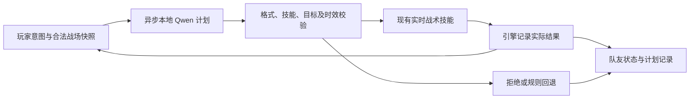

# Aegis Arena v4：近两年游戏 AI 技术参考

研究日期：**2026-09-11**；“近两年”按 **2024-09-11 至 2026-09-11** 计算。本文记录官方资料、接口核实与本作设计提案，**不代表功能已交付或性能已测得**。实现、实际模型调用和独立包证据应另行记录。

本轮方向是让本地小语言模型根据有限的战场事实选择队伍计划，由现有实时战术技能执行，并展示计划的实际结果。研究参考提供设计依据，不构成对 PUBG Ally 或 SIMA 2 的复现声明。

## 1. PUBG Ally / NVIDIA ACE：高层计划与即时动作分工

| 时间与来源 | 核实事实 | 使用边界 |
|---|---|---|
| **2025-01-06**，[NVIDIA CES 官方公告](https://www.nvidia.com/en-us/geforce/news/nvidia-ace-autonomous-ai-companions-pubg-naraka-bladepoint/) | 当时介绍的 PUBG Ally 使用 Mistral-Nemo-Minitron-**8B**-128k-instruct；ACE 组合语言、感知与动作技术。 | 这是当时公布的配置，不应套到后续 beta。ACE 于 2023 年出现，但本次引用的是 2025 年自主角色方案。 |
| **2026-06-17**，[NVIDIA beta 公告](https://www.nvidia.com/en-us/geforce/news/pubg-ally-ai-teammate-beta-available-now/) | 快速行为树负责移动、瞄准、即时战斗；认知侧由本地 ASR、**2B** SLM 和 TTS 构成，公告要求 RTX 至少 8GB 显存。 | 公布的两周体验截至 **2026-06-30**，该窗口已结束。页面标题的“Available Now”不能作为 9 月仍开放的证据；也不能从该产品要求推导 Aegis 的硬件门槛。 |
| **2026-06-25**，[NVIDIA 对 KRAFTON 的技术访谈](https://developer.nvidia.com/blog/how-krafton-built-pubg-ally-a-co-playable-character-powered-by-nvidia-ace/) | 引擎观测工具将局势转成文本，用户或游戏事件触发 SLM；低层 BT 不等待高层推理。访谈说明量化 2B、领域数据与自建游戏接入层的作用。 | 公开架构介绍不等于可下载的 PUBG 专用控制器、完整训练数据或 Aegis 即插即用组件。本作选择 Qwen 的本地接口，不声称接入 ACE。 |

**本作设计推断：** 把“守护玩家、集火合法威胁、集合/前往已知目标”等有限意图交给小模型；寻路、避障、射界检查、攻击预告、命中与冷却继续由确定性技能执行。模型输出一个意图不会自动证明角色完成了它。让引擎分别记录“采用计划”和“到达位置/实际造成伤害/目标推进”等结果，才能展示队友的协作价值。

## 2. SIMA 2：目标协作与结果验证，避免泛化能力误称

Google DeepMind 于 **2025-11-13** 发布 [SIMA 2 官方介绍](https://deepmind.google/blog/sima-2-an-agent-that-plays-reasons-and-learns-with-you-in-virtual-3d-worlds/)，将其定位为支持对话、较复杂目标与多模态指令的智能体，并明确是面向少量研究者和开发者的有限研究预览。该介绍也承认长任务、目标验证与低层精细动作仍有困难。

[技术报告 v1](https://arxiv.org/html/2512.04797v1)于 **2025-12-04** 提交。第 3.2–3.3 节描述的是 720p 画面输入与键鼠动作输出、基于 Gemini Flash-Lite 的专门训练；不直接读取底层游戏状态。第 4.4 节另有较慢的 Gemini Pro 向 SIMA 2 下达任务的分层实验。第 4.5 节的自我改进包含任务生成、奖励与重新训练过程，不能简化为“保存日志就会学习”。

**可用性判断：** 上述公开资料没有提供本项目可直接下载运行的 SIMA 2 权重或通用接入 API；本次未确认后续公开开放。普通 Gemini API 也不等同于 SIMA 2。

**本作设计推断：** 借鉴“目标 → 行动 → 观察结果 → 调整”的可检查循环。Aegis 使用引擎提供的有限结构化事实与已写好的技能，范围限于本作地图和任务。它与 SIMA 2 的视觉输入、跨游戏迁移和学习流程有实质区别；成果应称为“本地模型驱动的有限队伍计划”。不把内部推理文本作为真实性证明；展示经过游戏事实校验的短理由及行为结果。

## 3. Qwen3-0.6B：可实际部署的本地文本模型

Qwen 于 **2025-04-29** [正式发布 Qwen3](https://qwenlm.github.io/blog/qwen3/)，包含 0.6B 稠密模型。[Qwen 官方 GGUF 模型卡](https://huggingface.co/Qwen/Qwen3-0.6B-GGUF)标明 Apache-2.0、32,768 上下文及 Q8_0 量化。这是文本生成模型，不是视觉、语音或游戏策略专用模型；0.6B 的规模也不能保证复杂战术判断可靠。

本次核实的文件与来源如下；它们是下载核对信息，不表示本机已下载或加载成功。

| 项目 | 官方值 |
|---|---|
| 仓库 | `Qwen/Qwen3-0.6B-GGUF` |
| 本次仓库修订 | [`23749fefcc72300e3a2ad315e1317431b06b590a`](https://huggingface.co/Qwen/Qwen3-0.6B-GGUF/commit/23749fefcc72300e3a2ad315e1317431b06b590a) |
| 文件 | [`Qwen3-0.6B-Q8_0.gguf`](https://huggingface.co/Qwen/Qwen3-0.6B-GGUF/blob/main/Qwen3-0.6B-Q8_0.gguf)，网页标示约 639 MB |
| 文件 SHA-256 | `9465e63a22add5354d9bb4b99e90117043c7124007664907259bd16d043bb031`，来自上述文件详情，区别于页面的 Xet hash |

[Qwen 官方 llama.cpp 指南](https://qwen.readthedocs.io/en/latest/run_locally/llama.cpp.html)提供 Windows CPU/CUDA 运行方式，支持读取本地 GGUF，并说明本地 HTTP 服务地址及模型上下文限制。[llama.cpp 服务端文档](https://github.com/ggml-org/llama.cpp/blob/master/tools/server/README.md)当前明确支持 `POST /v1/chat/completions`、`response_format` 的 JSON/schema 约束和 `chat_template_kwargs: {"enable_thinking": false}`。这里的 OpenAI-compatible 是协议兼容；向本机地址发请求不意味着调用 OpenAI 云服务。

**接口版本差异：** Qwen 指南仍写着硬关闭 thinking 需自定义模板；当前 llama.cpp 文档已列出模板参数。应固定实际服务端版本，用该版本的 `--help` 和真实请求验证，不能假设任何旧二进制都支持新参数。`/no_think` 软提示不能代替格式约束和解析验证。限定 JSON 只能约束结构，不能保证计划符合当前游戏事实。

**本机方案提案：** 初次准备时下载并校验官方文件；运行时通过 `-m` 读取本地文件，服务仅监听 `127.0.0.1`，游戏不依赖外部推理服务。先使用非 thinking、小上下文和短输出，模型冷启动、CPU/GPU 后端、实际延迟和帧率竞争都必须实测。639 MB 是权重文件大小，不是进程内存或总显存开销。运行时离线可用与首次安装无需网络应分别表述。

## 4. Aegis 的建议范围与验收

下图是本作拟采用的工程设计，节点名称不是对外部产品接口的复述。

1. **让推理影响真实行动。** 计划只选择已实现的技能及合法目标 ID，首轮控制少量高层选择。无需让模型生成坐标、伤害、瞄准角度或可执行代码。手动队友指令立即生效并优先于旧计划。验收需保存真实本地请求、模型输出、实际采用的技能和游戏结果；预制回答或测试替身不得标成模型推理。

2. **控制信息和时间。** 快照只包含队伍根据游戏规则可知的角色状态、公开任务信息与允许共享的观察；从引擎取得数据不等于可以提供全部敌人的实时位置。每次请求带尝试编号、波次、快照时间和命令版本；重开、换波、目标失效或手动命令变化后拒绝过期响应。游戏线程不阻塞等待模型，同一队友最多保留一个有效在途请求；超时采用明确的现有战术回退。

3. **把展示重点放在协作承诺。** HUD 短句说明“正在保护你”“正前往中继”“目标已失效，重新集合”，并区分计划被接受与行动完成。画面或可打开的记录显示依据、动作、成功/失败/中断及时间。只有世界事件满足完成条件时才显示完成；无进展或路径失败应有反馈。本地模型未启用时明确显示规则控制，不渲染伪造的思考动画或推理文本。

4. **记录足以复查的证据。** 保存模型来源、修订、量化、文件 hash、服务端版本与二进制 hash、后端、上下文/输出上限、请求耗时，以及同一请求 ID 对应的输入事实、响应、采用/拒绝原因和结果。日志帮助调试和后续离线评估；没有训练过程就不宣称在线学习、永久记忆或策略自我进化。玩家界面用简短的任务信息，完整技术信息放在诊断记录。

5. **分别验证正确性和实际收益。** 正确性覆盖非法 JSON/未知技能、模型断开与慢响应、重开后晚到结果、目标死亡或不可达、玩家改命令、暂停/终局期间回调、回退后恢复，以及不越权获得敌人信息。再在同一地图做多场实际独立包观察，对比规则队友和模型队友的目标参与、有效支援、违背命令、卡住时间与推理延迟；保存失败局和原始画面。一次运行成功、测试通过或语言更流畅，都不足以证明队友更聪明或更有趣。

首轮不据这些参考承诺自由语音对话、ASR/TTS、跨游戏迁移、自动训练、玩家长期画像或 PUBG/SIMA 级别能力。每项能力是否已交付，以运行代码与对应的真实证据为准。
