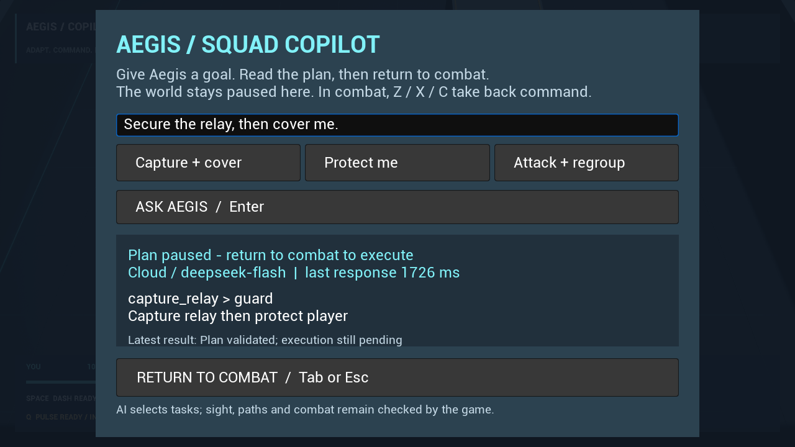

# Aegis Arena v1.3 · Squad Copilot

这轮在 v1.2 的守点、清敌与撤离玩法上，加入自然语言队友指令。部署后按 **Tab** 打开暂停面板，输入“先占住中继，然后掩护我”或 `Secure the relay, then cover me.`，由模型返回 **1–3 个有限步骤**；原有控制器继续负责寻路、视野、攻击与冷却。界面显示提供方、计划、当前状态和最近结果。截至 2026-09-11，真实云端语义评测、UE 云端接入、受控异常流程与本轮回归已有通过记录；具体范围见下文。

## 启动与操作

当前优先使用用户配置的 DeepSeek 云端服务，目标接口为 `https://api.deepseek.com/chat/completions`，模型 `deepseek-flash`（核实日 2026-09-11 对应 DeepSeek-V4.1-Flash）。默认关闭 thinking，请求 JSON，再由游戏检查技能和目标。官方接口与实现解释见 [技术讲解](squad-copilot-explained.md)。本版本不捆绑本地模型权重；本地 Qwen/llama.cpp 保留为实验选项。

保留完整的 `Windows` 文件夹，安装 Python 3.10+ 与 Tkinter。第一次双击包内 **Configure Aegis AI.cmd**，保存后双击 **Play Aegis Copilot.cmd**；已保存配置的同一 Windows 用户可直接启动。源码工作区也可运行 `python scripts/launch_copilot.py --configure`。**Save settings 只保存；Test connection 会发送一次小请求**，连接成功不等于意图或游戏行为已经通过。密钥用当前 Windows 用户的 DPAPI 加密保存，启动器通过子进程环境传入游戏，不放入命令行。

**独立包已完成构建、烹饪和归档。Development 包通过 30 项按键/正常退出检查与 13 项真实云端 Copilot 检查，八张原生 PNG 已复核；Shipping 的 17 项开发标记检查通过，未进行 Shipping 人工试玩。** 精确文件摘要、各批次绑定与原件见 [v1.3 最终验收](../evidence/upgrade-v4/acceptance.json)。

| 包 | 启动入口 |
|---|---|
| Development（本轮实际运行验证） | [Play Aegis Copilot.cmd](<D:/AegisWork/Packages/copilot-v1.3-development/package/Windows/Play Aegis Copilot.cmd>) |
| Shipping | [Play Aegis Copilot.cmd](<D:/AegisWork/Packages/copilot-v1.3-shipping/package/Windows/Play Aegis Copilot.cmd>) |

两个目录均提供同级的 `Configure Aegis AI.cmd`。本机已保存 DeepSeek 配置，可以直接使用 Play 入口。启动助手只复制代码，不包含 API 密钥或模型权重；需要保留整个 Windows 文件夹。旧 v1.2 包不含本轮功能，公开 v1.0 下载也不能用于演示 Copilot。

**1/2** 选 Guided/Pressure，**Enter** 部署；**WASD** 移动，鼠标瞄准，按住左键连射，右键近战，**Space** 闪避，**Q** 脉冲。**Tab** 输入目标，Enter 提交，Tab/Esc 返回战斗；回到战斗后 **Z/X/C** 分别保护、集火可见目标、集合守点，并取消旧模型计划。文本框里的 Z/X/C 是字母。**R** 返回新简报；**Esc/P** 打开菜单，点击 Quit to desktop 或菜单中按 **X** 退出。Copilot 面板打开时，第一次 Esc 关闭面板，再按 Esc 才打开游戏菜单。

## 计划如何落到游戏里

当前只接受 `guard`、`regroup`、`capture_relay`、`focus_visible` 四类技能。保护步骤维持五个游戏秒；集合需要实际靠近玩家；占点需要观察当前中继完成；集火需要队友对指定可见目标造成真实伤害。中继进度可能包含玩家贡献，不能把步骤完成说成队友独立完成。每步与整段计划都有时间限制，失去合法目标、路径无进展、死亡、换阶段或重开会结束旧工作。第一波占点后若同时满足过关条件，剩余保护可能因活动阶段结束而取消。异步响应必须匹配当前请求和角色，不得覆盖新的手动指令。

模型只接收有限的队伍状态、公开目标和队友当前可见敌人的匿名 token。导航、射界与战斗规则仍由游戏执行。服务未配置、请求失败/超时、输出无效或任务不可执行时，系统明确显示原因并回退到规则 Guard；不使用预制回答冒充模型。`Saved/AegisPlans` 中的记录连接输入、响应、采用的步骤与结果，帮助复查承诺是否兑现。短标签是任务摘要，**不是隐藏思维链**；记录日志也不是 RAG、强化学习或自动训练。

## 参考与范围

[研究记录](upgrade-v4-references.md)核实了 PUBG Ally 的 2025–2026 分层架构与 SIMA 2 的目标/行动研究。本作借鉴高层规划和即时动作分工，采用自己已有的游戏状态接口与四种技能；不接入 ACE，不复现 SIMA 2 的视觉跨游戏训练，也不声称达到商业产品的成熟度。玩家可感知的目标是更容易表达协作、能看到真实结果和失败原因。

本地 Qwen3-0.6B 的首批六例虽全部输出合法结构，意图检查为 0/6；同一批样本修订提示后，完整顺序为 4/6，未做独立保留集验证。云端十二条声明过的案例现已通过，但**小样本计划正确不等于实战配合改善**。完整数据路径与 3/8 分钟演示稿见 [Squad Copilot 讲解](squad-copilot-explained.md)。语音、长期玩家画像、在线学习、胜率或延迟优势均不在本轮已证明范围内。

## 验证记录

| 检查 | 已取得的结果与原始记录 |
|---|---|
| 可移植代码与脚本 | 严格 C++17 构建及 **381 条断言通过**；**117 项 Python 测试通过**，含配置、协议和证据校验反例。配置测试用假密钥，网络与进程测试使用替身。[便携验证](D:/AegisWork/Reports/upgrade-v4-portable-final/verification.json)、[Python 日志](D:/AegisWork/Reports/upgrade-v4-portable-final/python-tests.log)。 |
| UE Core | **6 项通过、0 警告、0 失败**，含 PlannerProtocol 的 **20 条协议断言**。[Core Automation](D:/AegisWork/Reports/upgrade-v4-builds/20260911-071151-145172a4ae77441f8963abfa2da3f608/automation/index.json)。 |
| 云端语义 | `deepseek-flash` 十二次一次性真实调用；原有六例、新措辞六例，结构、合法性及完整预定顺序均 **12/12**。耗时 **0.775–1.538 秒，中位 1.021 秒**。观测为合成状态，没有运行 Unreal。[语义报告](D:/AegisWork/AI/v1.3/cloud-evaluation-01/report.json)。 |
| UE 云端与 Slate | **13 项通过**：真实 Slate 输入、真实云端 HTTP、`capture_relay > guard` 计划验证、暂停后返回、队友移动、手动取消与重开。使用 Editor `-game` 和离屏渲染，非独立包或人工试玩。[云端游戏探针](D:/AegisWork/Reports/upgrade-v4-copilot-cloud-editor-01/provenance.json)。 |
| 最终独立包 | Development 的 **30 项输入/退出**与 **13 项真实云端 Copilot** 检查通过；二者均使用最终源码摘要 `2ee8534f…` 和实际包内 exe，离屏合成输入。云端包内该次响应耗时约 **1.726 秒**。[输入原件](../evidence/upgrade-v4/input-packaged/provenance.json)、[云端原件](../evidence/upgrade-v4/copilot-cloud-packaged/provenance.json)、[17 标记检查](../evidence/upgrade-v4/packages/shipping-marker-gate.json)。 |
| 受控异常 | **5 类 HTTP 场景、25 项通过**：坏 JSON、请求等待时手动接管、请求等待时重开、503、超时。使用本地 HTTP 替身、NullRHI、直接 Planner API 与合成按键；实际观察到约十秒本地超时，未调用模型。[故障探针](D:/AegisWork/Reports/upgrade-v4-copilot-fault-01/provenance.json)。 |
| 既有战斗回归 | [Tactical **32**](D:/AegisWork/Reports/upgrade-v4-tactical-final/provenance.json)、[Weapons **31**](D:/AegisWork/Reports/upgrade-v4-weapons-final/provenance.json)、[Operation **31**](D:/AegisWork/Reports/upgrade-v4-operation-final/provenance.json)、[Memory **28**](D:/AegisWork/Reports/upgrade-v4-memory-final/provenance.json)、[Trial **54**](D:/AegisWork/Reports/upgrade-v4-trial-final/provenance.json) 项均通过。它们是各自有明确干预的世界测试，不是自然实战胜率评测。 |

**云端游戏探针只证明接受计划后队友实际移动了超过 80 cm；返回战斗两秒后就手动切换保护并取消旧计划。它没有证明完整占点及后续 Guard 自动完成，也没有证明胜率或支援效果提升。** 故障探针的五次请求来自受控服务，不是五次真实云端故障；它覆盖所列异常，不能替代所有网络与任务失败情况。

这些记录**不属于全部相同的源码快照**。云端 Editor 探针与五组战斗回归使用摘要 `676f9ed3…`；最终仅修改 `AegisPlannerUI.cpp` 的 Submit 失败显示，使真实原因不再被“先部署”遮盖。逐文件对比 [最终 UI 修改前记录](D:/AegisWork/Reports/upgrade-v4-before-final-ui.json)，其余记录中的源码文件摘要相同，内容资产摘要也相同；故障探针使用修改后的 `2ee8534f…`。这说明改动边界，不能把较早报告改称为最终 UI 的重新测试。

真人中文输入、不同分辨率、按钮操作是否直观和队友是否有帮助，仍没有本轮人工体验证据。HTTP 替身、真实模型调用与合成 Slate 输入各自分开声明；旧 `AAegisInputProbe` 也不能代替新面板验证。历史包、源代码与旧证据见 [v1.2 Uplink](upgrade-v3.md)、[v1.1 Trial](upgrade-v2.md)；它们不自动证明当前 v1.3 的改动通过。

